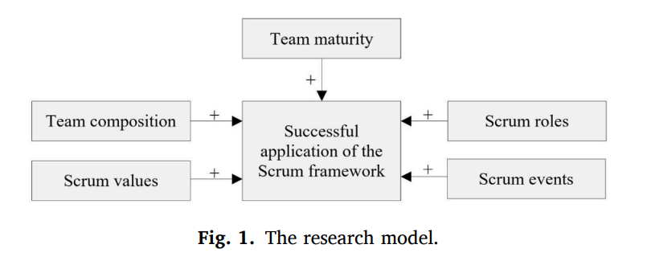

# Agile Method Spotlight
- Scrum
- Extreme Programming (XP)

---
# What is Scrum?
from scrumguides.org:

Scrum is a lightweight framework that helps people, teams and organizations generate value through adaptive solutions for complex problems.

---
### Scrum Theory
- empiricism and lean thinking:  knowledge comes from experience and making decisions based on what is observed.
- iterative and incremental approach
  - optimize predictability
  - control risk
- combines four formal events for inspection and change within a larger event (Sprint)
- primarily defined by its _roles, practices, and values,_ all of which are deliberately kept to a minimum.

---
### Scrum Roles
Scrum teams are small, self-managing, and not hierarchical
- **Scrum Master**: facilitate scrum use, ensure the scrum framework is followed
- **Product Owner**: represents the customer's interests; create and manage product backlog based on customer requirements and communicates to development what is important to deliver
- **Developers**: people who contribute to the development of the product (designers, writers, programmers, etc.)

---
### Scrum practices
Sprint: fixed length of time (1 month or less) where the work is done
- **Sprint planning**: lays out the work to be done
- **Stand-up meeting**: short daily meeting to discuss progress and identify obstacles. Originally termed “stand-up” so that they would have to be short if everyone stood.
- **Sprint review**: inspect the outcome of the sprint, discuss product backlog
- **Sprint retrospective**: the team identifies the most helpful changes to improve effectiveness

---
### Scrum Values
- Commitment
- Focus
- Openness
- Respect
- Courage
---

# Kadenic et al: "Mastering scrum with a focus on team maturity and key components of scrum"

---
## What they were interested in
Software development success has been evaluated in terms of:
- evaluation of project outcome metrics
- stakeholder satisfaction 
- team performance

Kadenic et al looked at **team maturity** and its impact on team performance, using Scrum as the agile method of focus

---
### Research Model

---
### Research Questions
- _Does team maturity impact the perception of successful application of the Scrum framework?_
  - perception of success was associated with team maturity (0.537)

- _How does team composition impact the perception of successful application of the Scrum framework?_ Most significant factors:   
  - fully allocated team members
  - team members received agile training
  - self-managing teams 

---
### Research Questions, cont'd

_How do Scrum values impact the perception of successful application of the Scrum framework?_

3 values were significant w/respect to perceived success:
  - teams that feel scrum values provide direction in their work
  - teams free to communicate openly about work and challenges with stakeholders
  - teams willing to embrace tough problems and do the right thing

---
### Research Questions, cont'd
_How do Scrum roles impact the perception of successful application of the Scrum framework?_

All 3 scrum roles contributed to successful outcomes. Key finding for each group:
  - **developers**: ability to daily adapt their plan towards the sprint goal
  - **product owners**: having the mandate to prioritize 
  - **Scrum masters**: ability to ensure that all Scrum events take place

---
## Findings
Key factors in the successful application of scrum:
- team maturity (how long the team has been in existence) 
- team members with necessary skills and expertise 
- low turnover rate among team members 
- ability to self-manage and make decisions internally 
- team members receive agile training

---
### Extreme Programming
A software development framework that seeks to produce high quality of code _and_ high quality of life for the developers.

Where scrum is minimally structured and purposefully focused on higher-level concerns, XP drills into details and focuses on a set of prescriptive practices.

---

### XP Practices (12 original practices)
- The Planning Game
- Small Releases
- Metaphor
- Simple Design
- Testing
- Refactoring
- Pair Programming
- Collective Ownership
- Continuous Integration
- 40-hour week
- On-site Customer
- Coding Standard

---
### XP Revised Practices
_from agilealliance.org_
- sit together
- whole team: cross-functional groups that all work together
- informative workspace: facilitate communication
- energized work: distraction-free
- pair programming: all production software is developed in this manner (one screen, 2 programmers)
- stories
- weekly cycle (iteration)

---
### XP Revised Practices, cont'd
- quarterly cycle (milestone): keep weekly work in context of larger project
- slack: include low-priority tasks in that can be dropped if needed
- ten-minute build: build and test system in 10 minutes
- continuous integration: code changes immediately tested
- test-first programming: write test, fail test, write code to pass test
- incremental design

[agile subway map](https://www.agilealliance.org/agile101/subway-map-to-agile-practices/)

---
## Scrum and XP 
- Compare the two methods

- Which do you gravitate towards?
- What would you prioritize: 
  - specific practices, or
  - philosophy?