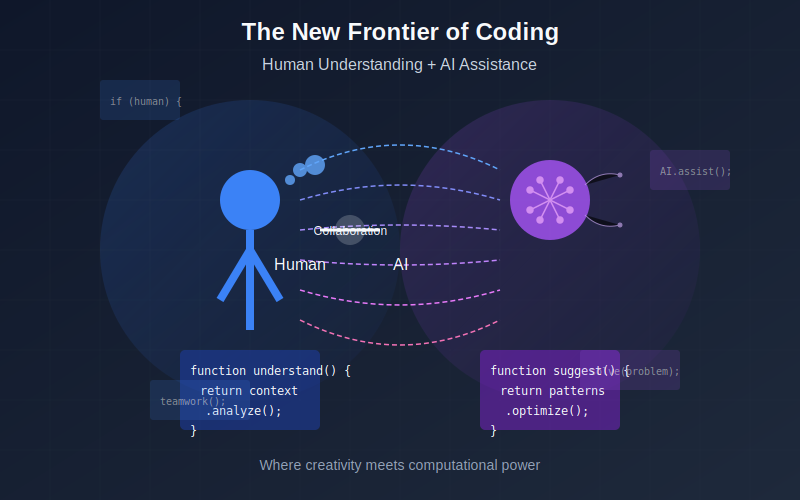
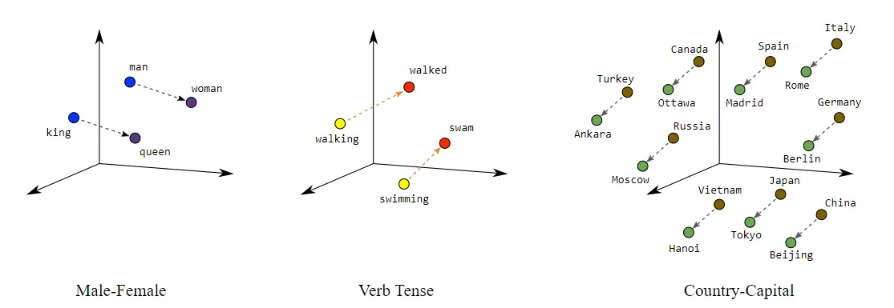
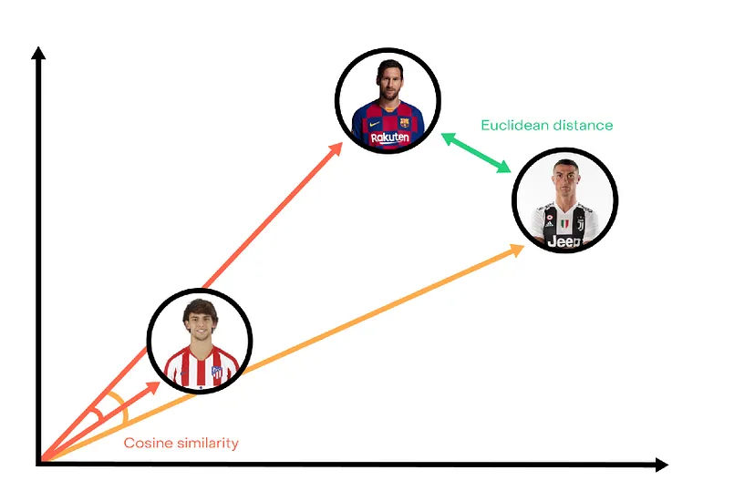
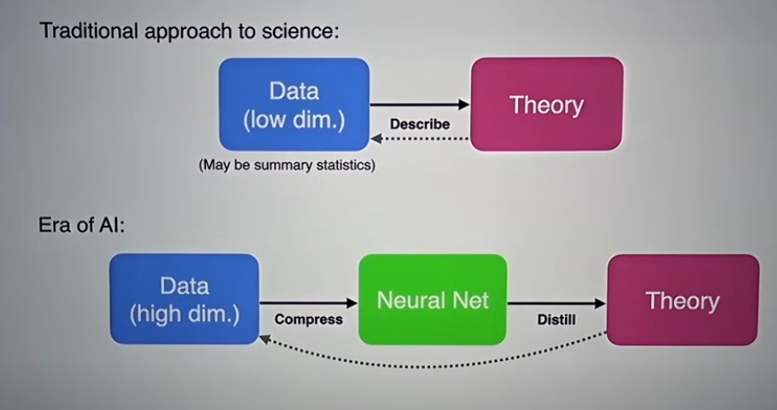
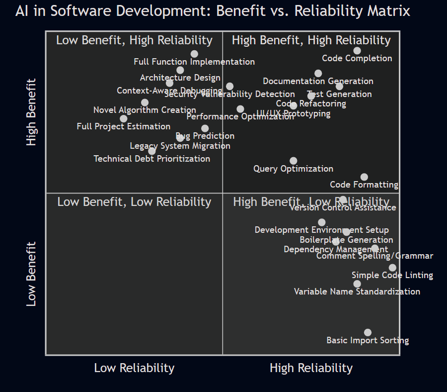
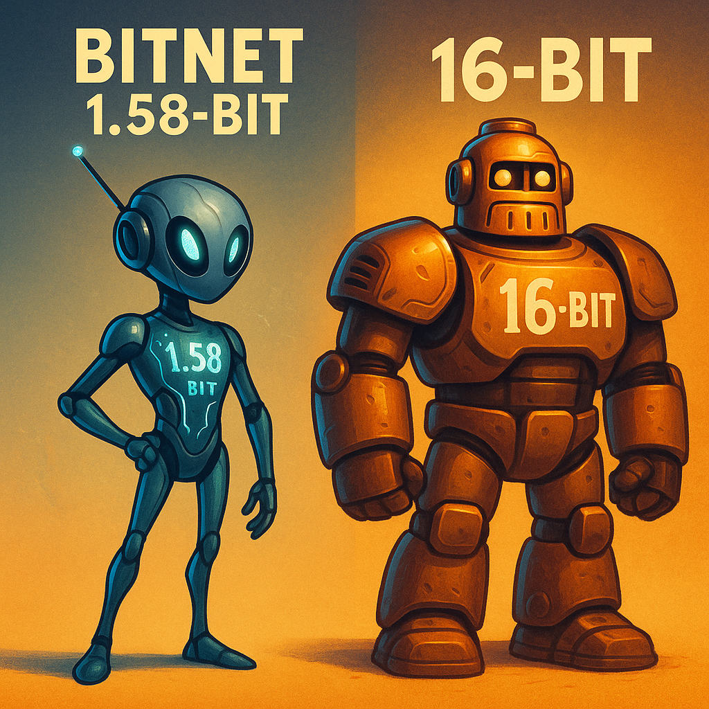
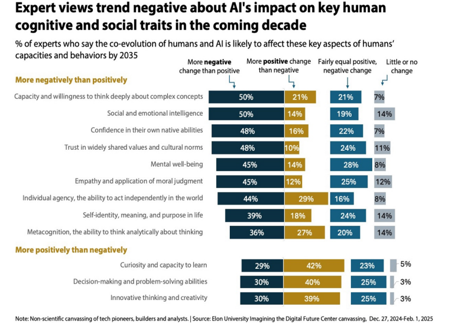

# Week 14: Coding & AI

---
# Agenda
- presentations
  - don't forget to complete your group peer assessments
- news/discussion
- lecture
- assignment due next week

---
# Discussion

- [tabsub](https://simon-frey.com/tabsub/)
  - in the concurrency lecture we talked about processes and their separation
  - each browser tab as a process that does not share memory or compute

---
## Readings/Resources
LLM explainers:

- [High-level overview of generative AI (17-min video)](https://www.youtube.com/watch?v=2IK3DFHRFfw)

- Timothy Lee & Sean Trott, 7/27/2023, [_Large language models, explained with a minimum of math and jargon_](https://www.understandingai.org/p/large-language-models-explained-with)

- [More detailed look at transformers & math behind them (26-min video)](https://www.youtube.com/watch?v=eMlx5fFNoYc)

---
## Readings/resources

LLMs and programming:
- Somers 2023, The New Yorker, 11/20/23, [_A coder considers the waning days of the craft (subscription required)_](https://www.newyorker.com/magazine/2023/11/20/a-coder-considers-the-waning-days-of-the-craft)

AI and Education
- [A high school student's views on education & AI](https://er.educause.edu/articles/2024/1/will-our-educational-system-keep-pace-with-ai-a-students-perspective-on-ai-and-learning%20)

---

---

Let AI explain its rationale for the construction of the prior image:
1. **The Human-AI Partnership**: The left side (blue) represents the human coder with their ability to understand context, while the right side (purple) symbolizes AI/LLMs providing pattern recognition and optimization.
2. **Connection & Collaboration**: The flowing lines between both entities visualize the two-way exchange of ideas and capabilities, forming a symbiotic relationship.
3. **Code Understanding**: The human side highlights "understanding" and "context analysis," representing the human ability to grasp the bigger picture and purpose behind code.
4. **AI Assistance**: The neural network-like structure in the AI side illustrates how LLMs process patterns to suggest optimized solutions.
5. **Shared Workspace**: The code snippets floating in the background show the collaborative environment where both human creativity and AI computational power come together.

---
## What is AI
[Coursera](https://www.coursera.org/articles/what-is-artificial-intelligence) defines it as: 
> _the theory and development of computer systems capable of performing tasks that historically required human intelligence_

.

We will focus on text-based **Large Language Models (LLMs)**

---
## Large Language Models (LLMs)
**large:** training datasets and the number of parameters (neurons) used
**language:** working with language
**models:** pre-trained to model the relationships among words
- generative models using a transformer architecture (a type of neural network)
- GPT = generative pretrained transformer

[7-min LLM section of cs50 lecture](https://www.youtube.com/live/0KmqnxXYJvA?si=oHNoVEwFQrySsjx4&t=3729)

---
## A brief history of how we got to LLMs

- **1972-mid 2000s:** 
Inverse document frequency (IDF) lived in statistical journals (N/appearances)

- **2008-13:**
TF-IDF (term frequency–inverse document frequency) and Natural Language Processing

- **2013:** word "locations" in physical space (word2vec)

- **2017:** transformer architecture
- **2022:** ChatGPT

---

#### TF-IDF and Natural Language Processing (2008-2013)
- **term frequency–inverse document frequency**: relates the frequency of a word in a document to its occurrence across a collection of documents
- "bag of words"
- matrices of word counts
- relative importance, "uniqueness" of words (words that appear once can have major impact in comparing two sets)
- crude measures of sentiment 
- word clouds

---

## Word "locations" in physical space: word2vec (2013)
- [word2vec](https://code.google.com/archive/p/word2vec/), vector representation of words ("geographic")
- word associations to each other, not just presence in a document
- can start to look at relationships among combinations of words or phrases that cluster together (n-grams)

---
### word2vec was great
Now had a spatial relation of words to each other, but left much to be desired...
- mostly had corpus of public domain books
- could measure sentiment via comparisons to Shakespeare
- no easy way to have relationships be persistent and modifiable
- many manual steps
- fragmented state of encodings (every researcher using their own datasets)

_For comparison image recognition tasks had ~95% success rate_

---
### Transformer architecture and "attention" (2017)
- Vaswani et al. 2017, [_"Attention is all you need"_](https://arxiv.org/abs/1706.03762)
- introduced a new type of deep learning architecture, the transformer architecture
- each layer adds **contextual information**
- generates persistent encodings that can be revised and used as a future starting point
- development led to release of GPT models and ChatGPT in 2022 (GPT-3)

---
## NLP: Then and Now
TF-IDF vs. LLMs...

or put another way:

Word cloud vs. ChatGPT...

---
## How LLMs work

source: [understandingai.org, Lee & Trott 2023](https://www.understandingai.org/p/large-language-models-explained-with)

The article covers:

- how language models represent and reason about language (**word vectors**)
- the basic building block for systems like ChatGPT (**transformer**)
- how models are trained 

---
### Word Vectors
- A way to represent words as a vector, i.e. [0.034, 0.245, 0.0987]
- word2vec (2013) introduced the vector ideas of **distance** and **directionality** to language
- could “reason” about words using vector arithmetic
- each item in a vector represents a dimension, such as part of speech, whether it is a capital city

Example: in a system using 300-item vectors to represent words, view the representation of the word ["orange"](http://vectors.nlpl.eu/explore/embeddings/en/MOD_enwiki_upos_skipgram_300_2_2021/orange_NOUN/)

---

### Vector math and inference

_image from [google developer](https://developers.google.com/machine-learning/crash-course/embeddings/translating-to-a-lower-dimensional-space)_

---
Vectors have distance (magnitude) and directionality (similarity)
_image from [towards data science](https://towardsdatascience.com/)_

---

## Meaning is dependent on context
- words can have multiple meanings
- meaning is thus informed by surrounding words

Consider a **bank (financial institution)** and a **bank (of a river)**
- two separate vectors
- meaning more influencial than spelling
- vector for bank (financial institution) is closer to the vector for the word "account" than to bank (of a river) 

---
## Transforming word vectors into predictions for the next word
- start with vector encodings for all words in the input text
- feed it into a neural network 
- each layer of the neural network is a **transformer** - it updates hidden state vectors and passes to the next layer
- builds additional "understanding" with each successive layer
- moves from single-word attributes (e.g. part of speech) to larger, contextual interpretations (e.g. which words modify/refer to other words - "this orange ball")

---
## Transformers

From the Lee & Trott article:

_The transformer has a two-step process for updating the hidden state for each word of the input passage:_

1. _In the ***attention*** step, words “look around” for other words that have relevant context and share information with one another._

2. _In the ***feed-forward*** step, each word “thinks about” information gathered in previous attention steps and tries to predict the next word._

---
## Step 1: Attention
Attention is likened to a matchmaking service for words:
- a **query vector** describes the characteristics of words that it is _looking for_
- a **key vector** describes a _word's own characteristics_
- query vectors and key vectors are compared for agreement (matrix multiplication)
- information transferred from _key vector word_ to the word that produced the query vector

---
## Step 2: Feed-forward
After attention heads transfer information between matching word vectors, the **feed-forward network** looks at these updated vectors and tries to predict the next word 
- uses information from the attention heads
- each neuron computes a weighted sum of its inputs, then looks for matching patterns determined by the training data
- when a neuron finds a match, it adds information to the word vector

---
## Recap

#### attention heads
- retrieve information from preceding words in a prompt
- compare relationship of words to each other

#### feed-forward layers 
- allow LLMs to “remember” information not in the prompt
- add information based on weights calculated during the training process

---
### Training the models (gPt)
- models initialized with vectors of random weights
- examples are provided to the model (training data)
- weights are adjusted with additional training data

--- 

### Training steps 
run for _each word_ in the training data:
   1. forward pass: check if current weights produce the next word found in the data
   2. backward pass: use the information from the forward pass to go backwards and revise the relevant weights

---
## The Impact of Scale
- GPT-4 trained on ~13 trillion tokens (token = word, character)
- average 10-year old has encountered 100 million words
- [openAI found](https://arxiv.org/pdf/2001.08361.pdf) that an increase in model size, training size, and training compute increased accuracy

- more recent models have been reducing training data size, focusing more on _quality_ and _speed_

---

GPT-4 was trained only on text (no images), and having never seen what a unicorn "looks" like, was asked to draw one by writing code for an obscure graphics programming language (TiKZ). It produced:

---
## Areas of Impact
(relevant to this course)

- Education/learning
- Scientific inquiry & Research [Miles Cranmer talk, 1 hr](https://www.youtube.com/watch?v=fk2r8y5TfNY)
- Programming/Software Development

---
## Impact on education
Takeaways by high school student William Yin:
1. Any technology can be used for good or bad; which depends on us
2. Educational system will have to adapt to new ways of accessing and processing information
3. Education will increasingly become personalized
4. AI-assisted learning will promote equality in education

---
## Impact on scientific inquiry (research)

Scientific inquiry is concerned with theorizing, collecting and analyzing data and establishing connections to support theories

This process consists of collecting data, analyzing and testing the data in support of establishing connections

**LLMs have billions of unseen (by us) connections...**
- we now start with a massive set of established connections 
- probe and distill into theory
- [google's co-scientist](https://research.google/blog/accelerating-scientific-breakthroughs-with-an-ai-co-scientist/)

---
From Cranmer's talk:

---
## Impact on software development

Recall the Development stages:
- Plan 
- Code 
- Build 
- Test 
- Release 

Which stages can benefit from the use of AI?  

---
## Software Development Process

1. requirements
2. user stories -> tasks
3. Code: Discuss Implementation details, pair programming
4. Review Code & check-in
5. Test

---
## Software Development Process w/AI
1. requirements
2. user stories
3. code: 
 - (a) feed stories into LLM, have it write code/tests/documentation, or 
 - (b) developer codes with AI as coding assistant
4. human review & check-in

---

## Types of AI tools

- General/conversational
- Augmented Search
- Domain-specific (i.e. coding tools)
- Agents (execute specified actions on your behalf)

Differ with regards to:
- context/presentation of the application
- use cases and use patterns

---
## General/Conversational - Examples

- ChatGPT (OpenAI)
- Llama (Meta)
- Claude (Anthropic)

---

## General/Conversational - Use cases
- ideation, generation
- summary
- Q & A
- troubleshooting

Skills needed
- effective prompt writing
- understanding of models and ability to tweak

---
## Augmented Search
Search that summarizes your query along with specific citations used to generate the response

- performs search (resrources)
- performs summarization (of search results)

Examples: 
- [phind.com](https://www.phind.com)
- Google

---
## Domain-specific: Coding Assistants

Too many examples to list

A majority of these tools provide an interface into the same/similar model services

- models specifically trained on code
- emphasis on high quality, relevant data
- context (size) and other settings are very important

---
## Coding assistant use cases
- code creation 
   - can be based on description, input text, comments, etc.
- code suggestions/autocomplete
- code summary
  - generate documentation
  - generate comments
- test creation
- refactor code

---
### Coding assistants with VScode extensions
- github copilot 
- tabnine (have to sign up for free account)
- llm-vscode (huggingface.com API needed)
   - create free account: https://huggingface.co/
- Cody (https://sourcegraph.com/cody)
- continue

---

### Local vs. External
**Local (your hardware)**
- need a smaller model
- somewhat less effective
- your data not uploaded
- ex: ollama

**External**
- standard HTTP requests

---
# What are LLMs good at?
Classify tasks based on two criteria:
- benefit: how beneficial is it?
- reliablility: how frequently can it execute successfully?

---

### 4 quadrants
**Reliability** along x-axis (moving to the right = more reliable)
**Benefit** along y-axis (moving up = more beneficial)

_Quadrants move counterclockwise beginning with lower left_
- Q1: Low Benefit, Low Reliability
- Q2: Low Benefit, High Reliability
- Q3: High Benefit, High Reliability
- Q4: High Benefit, Low Reliability

---

---
## Quadrant 1: Low Benefit, Low Reliability

- Full Project Estimation
- Technical Debt Prioritization

_Key:
? - perhaps should be in another quadrant
! - was placed in another quadrant by Claude Sonnet 3.7_

---
## Quadrant 2: Low Benefit, High Reliability

- Comment Spelling/Grammar Checking
- Generating boilerplate code (?)
- Variable Name Standardization
- Formatting data
- Managing imports

_we struggle with motivation on rote / repetetive tasks..._

---
## Quadrant 3: High Benefit, High Reliability

- Code Completion
- Documentation: generating, summarizing
- Explaining: complex concepts, code
- Help debug tricky error messages
- Drafting unit tests 
- UI/UX Prototyping
- Code Refactoring (?)

_common pain points of coding..._

---
## Quadrant 4: High Benefit, Low Reliability

- Full Function Implementation
- Architecture Design
- Security Vulnerability Detection
- Performance Optimization
- Bug Prediction
- Novel Algorithm Creation (!)
- Context-Aware Debugging (!)
- Legacy System Migration (!)

---

## VS Code extensions - Copilot

VS code extension managment

[flip.py](../scripts/wk14_flip.py)

---
## Where are LLMs going next? 
### Areas of active research

---
### _Enhanced Explainability_
- finding out what they "know" about topics, [article about the research](https://news.mit.edu/2024/large-language-models-use-surprisingly-simple-mechanism-retrieve-stored-knowledge-0325), the [research paper Feb 2024](https://arxiv.org/pdf/2308.09124.pdf)
   - tested functions by changing the subject, probing models to produce a grid ("attribute lens") that visualizes where specific information about a particular relation is stored
- ["On the biology of a large language model", March 2025](https://transformer-circuits.pub/2025/attribution-graphs/biology.html) (Anthropic research)
- [auditing AI for hidden objectives](https://www.anthropic.com/research/auditing-hidden-objectives)

---

### _Enhanced Reasoning Capability_
Adding context, reasoning, awareness, discoverability
- [Using pseudocode to guide LLMs, research paper](https://arxiv.org/abs/2404.02575)

- [Teaching LLMs to reason](https://arxiv.org/abs/2403.09629)
   - attempt to have LMs generate "rationales" at each token to explain generated text & use it to improve their predictons 

---
### _Enhanced Functionality_
Unbounded **context length** (the number of tokens from input text that the model considers when responding)
- https://arxiv.org/abs/2404.08801

Enhanced Privacy Protections
- [homomorphic encryption for LLMs](https://engineering.nyu.edu/news/encryption-breakthrough-lays-groundwork-privacy-preserving-ai-models)

---

### _Reduced energy and memory consumption_
the bulk of any LLMs is matrix multiplication; processing billions of LLM model parameters is cpu and energy intensive

Bitnet
- [BitNet paper](https://arxiv.org/pdf/2310.11453.pdf)
- [BitNet modifications that puts it on par with much larger encoding models](https://arxiv.org/pdf/2402.17764.pdf)

Deepseek

---

---
### 1.58 bit models (modified BitNet)
- typical LLM stores weights in 16-bit floating point values
- 1.58 uses ternary weights: [-1, 0, 1]
- reduces precision of weights (16->2 bit) and activations (or output of a neuron, 16->8 bit)
- eliminates need for multiplication; only addition and subtraction b/c values are only -1, 0, 1
- inference-time efficiency gain (no training efficiency gains)
- matches end-task performance of 16-bit transformers

---

---
##  Looking to the future
- near future
- socio-technical & farther future

---
### Looking to the IMMEDIATE future
- enhanced coding capabilities, improved workflows
- vastly improved learning curves, especially for basic, foundational knowledge
- continued adoption
   - penetration into new areas
   - refinement of existing uses
- widely accessible
- "golden age of LLMs"? (proportion of valuable training data vs. artificially generated data)

---
## Socio-technical: Our tools affect us
future with AI is not deterministic
- we will be changed by use of these tools 
- we will change and shape these tools

---
## Our tools affect us

- habits (subconscious)
- [physiology, biology, psyche - 'pharmacology'](https://aeon.co/essays/bernard-stieglers-philosophy-on-how-technology-shapes-our-world) 
- ideas (subconscious & conscious)
- how we see ourseleves in relation to the world (conscious)
- [Being human in 2035](https://imaginingthedigitalfuture.org/wp-content/uploads/2025/03/Being-Human-in-2035-Executive-Summary.pdf)
  - 300 tech experts surveyed

---

---

## Future
Like anything, there are risks and rewards

We have seen the remarkable effectiveness of these systems and their potential impact across society, but also a number of risks

---

---
Here is ChatGPT on its (harrowing?) vision on being human in 2035:

`"I pictured a hopeful sunrise over a green-roofed skyscraper garden, where people seamlessly blend nature, community, and high-tech life—AR holograms, drones, and autonomous traffic buzzing below."`

---
### AI & Coding

#### Pros: 
- ideation
- code creation 
- code suggestions/autocomplete
- code summary (generate documentation, comments)
- test generation
- tutor

---
#### Cons:
- more niche applications may not have enough relevant data in training sets
- over-reliance can rewire our brains and reduce skill levels
   - [copilot enforced bad coding habits and atrophy in skill](https://www.youtube.com/watch?v=Wap2tkgaT1Q)
- inconsistency of results (not a deterministic process)
- your codebase can become unrecognizable, and if AI cannot fix it at some point in the future...

---
### AI tools as part of a balanced diet
**embrace them**: use where you can, learn from them

**avoid overdependence**: 
- exercise your skills outside of the tools
- accept suggestions critically
- continue to think!
- recognize models for what they are
- be cautious when picking tools: privacy, security, use of your data

---
### Painter or Sculptor?

---
### Assignment: AI coding tools
**Instructions**
- Individual assignment
- Clone your team repo on your machine
- use AI tools as outlined in the assignment
- class discussion 5/7

