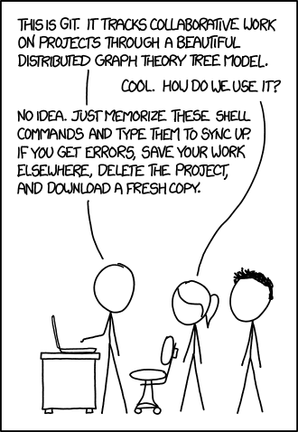
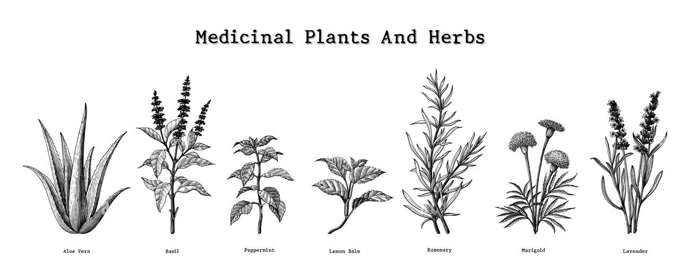
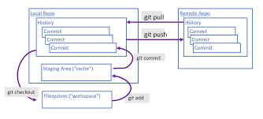

# Introduction to Git and Github

---
**What is Git?**
A _version control_ system for methodically tracking and managing changes to a codebase (repository). Can communicate changes made locally to remote code storage locations (i.e. github) and vice versa.

**Where do you access Git?**  
_In the terminal_ . . . . . .

**What is Github?**
A place to remotely store a codebase where you and others can access and manipulate it with Git.

---
## CAMP =

## REMOTE REPOSITORY (Github, Gitlab, Bitbucket, etc.)

_*This is a special tent with one magical property: with the push of a button you can copy all the tent's contents into your backpack (`git clone`)_

---

## BACKPACK =

## LOCAL REPOSITORY (your computer files)

Your backpack consists of 3 parts:
- Existing contents (_working directory_)
- Notepad to track what you will add (_Index_) `git add`
- Original contents plus those you have tracked and then add (_Head_) `git commit`

---

##### Your team forgot to pack some items, and you need to gather the following:

- Food
- Medicine
- Fire supplies (wood, kindling, striking rock)

You and 2 of your teammates push the magic button (`git clone`), creating identical copies of all tent contents in your packs. The 3 of you then head out in separate directions

<==---- -||--- ==> 

---
You have been assigned to provide medicine: 

You observe several plants and write in your notebook those you plan to harvest (`git add`)
-- ---

---

You harvest some plants and try them on an irritated area of your skin, and it relieves the itching. You are confident what you have collected will fit the needs of camp and *you place them in your backpack* (`git commit`) 

The mesquite tree has medicinal uses but the pods are also edible. 

To check if your teammates already brought mesquite back you radio camp and find out that the contents of the tent have not changed (`git fetch`)

---

You head back to camp and deliver all of the medicinal plants stored in your backpack to the tent (`git push`) 

Shortly after, the other team members radio back to camp (`git fetch`) and see what you have delivered. 

They want the plants you added in their backpacks without having to return to camp, so they use the tent's magic to get only the new items in the tent they do not have in their packs (`git pull`)

---

---

### Local Only:
- _`add`: instruct Git to locally track changes to a file (or files)_
- _`commit`: prepare local changes ("stage") to be sent to a remote repo_
### Local ---> Remote
- _`push`: send changes from local repo to remote repo (github)_
### Remote ---> Local:
- _`pull`: copy new changes from a remote repo (github) to your local repo. Equivalent to fetch + merge._
- _`clone`: copy all contents of a remote repo_

---
Another way to visualize it:
 

---

## [Git and Github installation and setup](week02_03_src.md)

