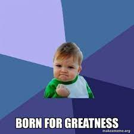
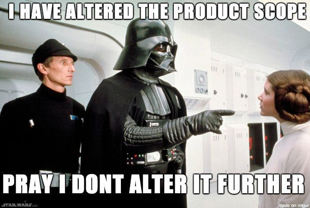
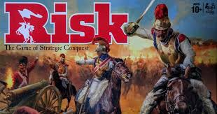
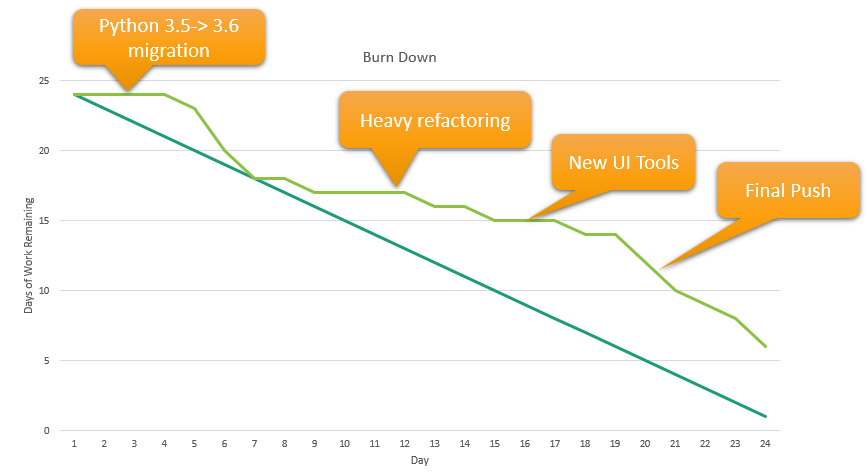
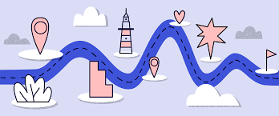
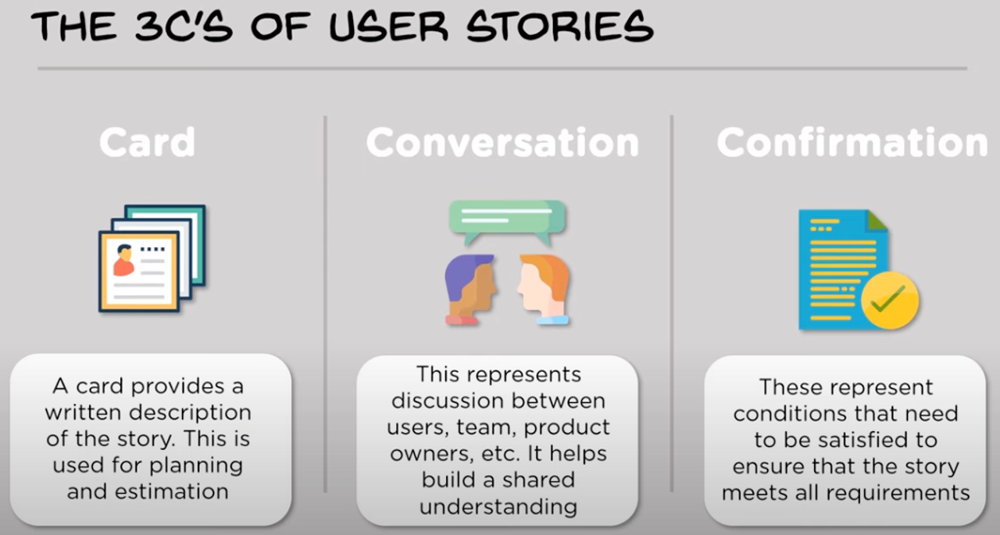
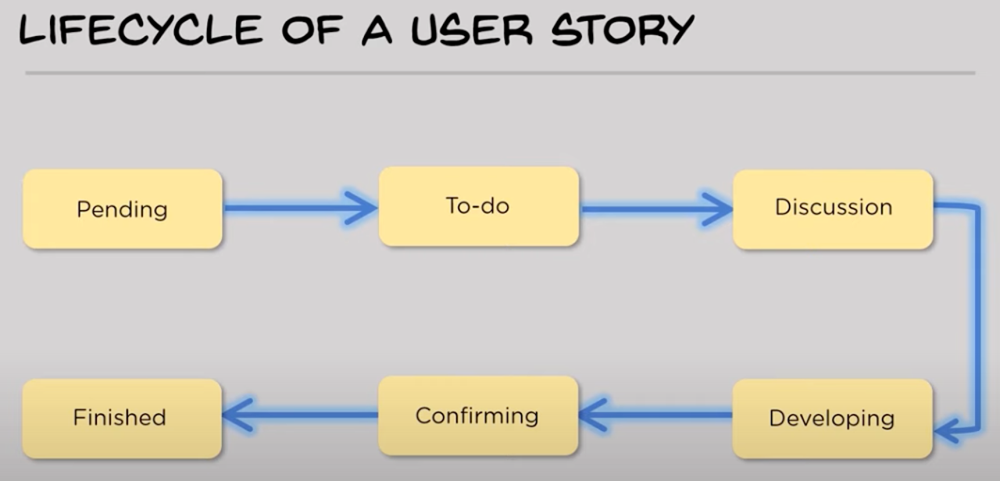

## <!--fit--> Pilone & Miles Ch 1:  Great Software   Development

---
### What makes great software?
- it is what the customer wants
- it is on time 
- it is within budget

_Anything else?_

This course will cover processes and techniques to attempt to achieve those 3 goals 

---
### Iteration
Wikipedia:
_Iteration is the repetition of a process in order to generate a sequence of outcomes_ 

In software development, an ___Iteration___ is:
- fixed length of time (roughly 1 month, ~20 working days)
- at the end of the time you have working software that contains a set of features
- required features are assigned to iterations based upon customer priorities and developer time estimates

---
### Iterations involve
- all stages of a complete process: 
`requirements -> design -> code -> test`
- production of complete, working software
- check-in with customer at the end to demo
### Quality software through iterations
- software gets more complex and complete with each iteration
- Iterations combine to produce milestones and releases
- after final iteration, software is what the customer wants?

---

## Goal #1: it is what the customer wants

_Customer-driven rules for success_: 1) the customer is always right.
2) when in doubt, refer to rule 1.

A project that does not provide what the customer wants is a failure.
It doesn’t matter whether the customer ‘signed off’ on requirements.

_What is there to like and dislike about this philosophy?_

---
### Agile in action: making adjustments
- When new features arise, they are fit into remaining iterations, based on customer priorities and developer estimates of time needed
- If doing this would push the due date, the customer decides what to do:
  - drop features
  - extend due date

_what if the customer won't do either?_

---
## <!--fit--> Pilone & Miles Ch 2:  Gathering   Requirements
---
### Requirements
A requirement is a ***single thing*** the software has to do.

- Where do initial requirements come from?
- Refine requirements by talking to the customer
  - clarify existing requirements 
  - uncover additional requirements
- good requirements must include the right stakeholders
- try as many techniques as needed

---
### Getting requirement information from customers
- Bluesky: brainstorming session where anything is on the table
  - ignore feasibility
  - dream about big ideas
- Find out what people do
  - role play: customer attempts to do their job with you as the "software"
  - observation: watch how people are currently doing their job (do this multiple times with multiple people)
- ask, ask, ask
  - there should be NO assumptions left
---
### Requirements and User Stories
Remember, a **requirement** is a single thing the software has to do. 
A **user story** is essentially a requirement that is written from the user's pespective: a story about how the users interact with the software.

A good user story:
- describes one thing the software needs to do
- is written in language the customer understands
- is written by the customer (their words/ideas, not necessarily their handwriting)
- is short: no more than 3 sentences. _What if there is more to say than this?_

---
### What user stories are NOT
- design decisions
- long essays
- filled with technical terms users do not understand
- technology specifications - they should not mention any technologies

---
### Developing a set of requirements
The set of requirements describes WHAT your software should do.
- capture basic ideas
- bluesky
- construct user stories
- ask, ask, ask: refine/clarify/correct user stories

Repeat this process every iteration.
Recall an iteration is a cycle of:

`requirements` -> design -> code -> test

---
### Estimates (Goal #2: on time)
__How long will this take?__ 
User stories contain the WHAT of your project, estimates provide the WHEN.

Project estimate = sum of estimates for all your user stories 

A user story estimate includes time to _design, code, test, and deliver_.

Each team member:
- Reviews each user story
- notes a time estimate for each
- includes any assumptions that are a part of their estimate

The team then meets and discusses the estimates and assumptions. 

---
### Review Poll
Pilone & Miles Ch2 Check-in quiz (Canvas)
- what gets estimated?
- who does estimation?
- what is a good iteration duration?
- milestone vs. iteration length - which is longer?
- what is a good user story duration?

---

### You try it
How long would it take you _in hours_ to make and send a raspberry lemon cake to a friend?
- this includes time to shop for ingredients, preparation, baking, tasting and shipping

- type your number in chat but do not hit enter

---
### Closing in on a reliable estimate: Planning Poker
An estimation tool that integrates the knowledge of everyone on the team to arrive at good estimates. Use to refine user story estimates when the initial estimates diverge.

- contains the following cards: \
`0`, `1/2`, `1`, `2`, `3`, `5`, `8`, `13`, `20`, `40`, `100`, `?`, `break`
- place a user story in the middle
- everyone places one of their time cards face down on the table, turn them up simultaneously
- dealer marks spread
- discuss large spreads, tease out assumptions and get customer clarification if needed
---
### You try it: 
How long _in days_ would it take you to:
- create software where a user can create an editable note in their browser?
- go to the following [zoom whiteboard](https://zoom.us/wb/doc/ZK96c25eQ2y2Nc_07bYj6g/p/255773339877376) 
- select one of the sticky note values
- copy and paste it on the right side of the line (Ctrl + D)

---
### Planning poker outcomes and questions
- What do you do with a really large spread?
- What do you do with assumptions?
- What happens if you can’t eliminate them all?
- How long is too long for a user story estimate?
- What does it mean if your estimate of a user story is too long?

---
### Getting a Final Estimate
- Use “converged estimates” (consensus estimates) resulting from cycles of:
  - talking to customer
  - planning poker
  - assumption clarification
- Add them up
- Prepare to be shocked
- What do you do when the total is too long?

---
## <!--fit--> Pilone & Miles Ch 3:  Project   Planning

---
### Prioritize with the customer
You can expect that:
- Customers want their software when they need it
- Developing everything the customer says they want can take too long

Make sure to communicate:
- Customer sets the priorities
- Must decide what to include in Milestone 1.0

---
### Milestone 1.0
- First major release
- First time to “get paid”
- Focus only on what’s needed
- Customer decides which features to include
- Time required for work must fit within time available
---

### What if required features don't fit in the available time? 

- Cut functionality - remove user stories not absolutely essential fo functioning software
- Ship a milestone build as early as possible - focus on an early success to gain momentum
- Push to later milestones all features not essential to baseline functionality
---
### Why not just add to your team? 
- New team members must get “up to speed”:
  - Must understand the software, technical decisions, how everything fits together
  - acquire right tools, equipment
- Negative relationship between number of people and communication
- “Inverse U” relationship between number of people and productivity

---
### Planning for Milestone 1.0
- Establish team size
- Estimate person-days of work to be done
- Determine person-days available
  - exclude weekends
  - account for overhead days: vacations, sick days, meetings and other work, non-productive days (tool install, email, etc.)
- Calculate excess work in project (estimated – available)
- Keep iterations short (allows more feedback)
- Keep iterations balanced (changes, new features, bugs, etc.)

---

### Estimating project schedule: Velocity
___Velocity___ is the way to account for all the overhead days and non-project work time. Given a number of work days, it is the **% of that time that is productive work**. 

A decent starting velocity is 0.7 with a new team. Adjust as needed with each iteration. Be sure it reflects the most accurate, realistic estimate possible.

---

### Estimating project schedule: Days required to get work done
Take your estimated days of work needed for development and divide by the velocity.

Weekdays needed for project =
days of work / velocity

---

### Estimating project schedule: Work Days Available
Start with calendar days, then account for weedends and velocity.
- Calendar days = due date – current date
- Weekdays = calendar days – weekend days
- Available days = weekdays * velocity
- Work days = available days * size of team

Compare available days with weekdays needed

---

### Example Milestone Time Estimate (1/2)
Project overview:
  - 200 estimated work days (only priority user stories, best estimate)
  - 4 member team
  - 3 month due date

Available Days (adjust for weekends and velocity)
- calendar days: 90 (3 months)
- weekdays: 90 * 5/7, or 64 days
- available days = 64 * 0.7, or 45 days
- **total work days available** = 45 days * 4 team members, or **180 days**
---
### Example Milestone Time Estimate (2/2)
Available: 180 days
_After accounting for velocity and weekends, there were 180 available work days across your entire team._

Needed: 200 days
_There was an estimated 200 work days needed._ 

The number of needed days exceeds the number available:
- 200 needed - 180 available = 20 days

**Therefore, 20 days of work needed to be re-prioritized.**

---

### Use Velocity when planning iterations
The prior example looked at applying velocity to re-prioritize features to make sure you can deliver what is needed on time. You can use a similar technique to time-check your iterations.

Apply your velocity to iterations:
- _Iteration work capacity = \
team members * working days in iteration * velocity_
  - 4 people * 21 work days/iteration * 0.7 = \
60 person-days per iteration
- Add iterations to get total milestone estimate 
  - 60 days * 3 iterations = 180 days until milestone can be completed

---
### Managing customers
Your iterations are all mapped out, and you realize you can’t get all the work done for Milestone 1.0 in the planned number of iterations. 

What now?
- Add an iteration (longer development schedule)
- Request deferring some user stories to Milestone 2.0
- Be transparent about how you came up with your estimates
- Do NOT overpromise

---

### The Big Board (pg 100)
A software development dashboard to track the current iteration progress. Helps track:
- What work is in progress
- What’s in the pipeline
- What’s done
- Burn Down chart

---

### Burn down chart
Plots total work left in the iteration against days remaining
- “ideal” line goes from amount of starting work to zero work at the end
- “actual” line comprised of points added based on your estimates at meetings
- It’s good when the actual points are below the ideal line!

---
## Sanity break: Where we're at
- Capturing basic ideas
- Brainstorming 
- Construction of user stories
- Refinement of user stories with customer feedback, resulting in clear and concise user stories
- User story estimation
- Clarifications from customer, refinement of user stories, elimination of assumptions
- Project estimation

---
## <!--fit--> Pilone & Miles Ch 4:  User   Stories

---
### User stories

Broad definition from earlier: a story about how the users interact with the software.

Refine this to be a bit more specific:
***the smallest piece of work that represents some value to the end user and can be delivered during a sprint***

User stories are always:
- user-centric
- written to capture a function of the software

---
### I.N.V.E.S.T. in good user stories
- **Independent**: _can be developed in any sequence; changes to one don’t affect others_
- **Negotiable**: _team decides how to do them_
- **Valuable**: _each user story gives the client one thing she/he wants_
- **Estimable**: _able to guess how long it will take to do it_
- **Small**: _one sprint sufficient to design, code, test_
- **Testable**: _clearly defined acceptance criteria_

---

## User story format
As a **[type of user]**, I want **[an action]** so that **[a benefit/a value]**

As a **passenger**, I want to **link the credit card to my profile** so that I can **pay without cash quickly and easily**

---
### Acceptance criteria
The criteria for satisfying the functionality described in a user story. These are subjective by nature.

Sample User story: \
As a rideshare passenger, I want several available drivers to be displayed so that I can choose the most suitable option for me.

Possible acceptance criteria: 
- App shows drivers who have been online recently and don’t have rides
- App shows drivers closest to user
- User can browse a list of drivers

---
### What good are user stories?
- Allow you to:
  - manage backlog of features
  - provide time estimates
  - prioritize functionality
  - plan
- Keep you focused
- Enable creativity
- Keep the development customer-centric
- Allow project to be managed effectively
- Finishing them feels good!

---
### How to write user stories
- originally "written" by customer (_product owner_, or customer rep, in scrum)
- steps for your team to take:
  - list end users whose needs you are trying to satisfy
  - define the actions they would need to take
  - think about the value these actions would have (would anyone pay for this)
  - discuss acceptance criteria
- always keep the focus on users
- think about external AND internal customers (what employees might need to do their work)
- limit to one action per story; action is what it does for the _user_
- discuss and eliminate assumptions/ambiguities

---

_source: simplilearn scrum master course_

---

## User Story Tips
- Listen to feedback
- Hold off on details
  - focus on WHAT, not HOW
- Keep as concise as possible
- Record on index cards, post-it notes, or project management software

---

_source: simplilearn scrum master course_

---
# Tasks
A ***task*** is a description of functionality that supports completion of a user story. It is a very specific piece of development work that needs to be accomplished by an individual developer as part of satisfying a user story.

User stories are broken down into tasks, with each story typically containing multiple tasks.

Tasks:
- are NOT user stories
- should include implementation details necessary for its development
- need a title, a description, and an estimate
_how could they be estimated?_

---

## So many estimates...
At each stage of development, we have been estimating the work remaining, comparing it to available time, and revising the plan accordingly. In a way, we are iterating towards more reliable estimates.

Have moved from left to right:
- `Requirements` --> `User Stories` --> `Tasks`
- `Milestone` --> `Iteration` --> `Sprint`

---

## Planning with Task Estimates
Revise your remaining work estimates after estimating tasks
- shorter estimates are more reliable than longer ones
- smaller scope yields more accurate estimate
- update your burn-down chart

---

## Work on Tasks
- Assign each task to a developer
  - who would be best, or
  - whou could benefit/learn the most
- Can bundle tasks if there is a good reason to do so
- typically work on __one task at a time__
  - _when would deviations be acceptable?_
- keep everyone busy, but not _too_ busy

---

### Updating your Big Board
- add tasks to the big board (they will all be associated with their user story)
- move tasks actively being worked on into "in progress" swim lane
- completed tasks get moved to "completed" section
- when all tasks for a user story are complete move the user story to "completed"
---

## Meeting with your team
- Track group progress
- Update burn-down rate
- Update tasks
- Talk about what happened since last meeting
- Discuss what will occur between now and next meeting
- Bring up any issues
- Frequency & Duration
  - Scrum: Daily, 5-15 mins
  - Team project: 2+ times per week, 10-30 mins

---
## Adding Tasks
#### Developer
- sometimes you identify new work that could save time later

#### Customer
- wants something new
- talk to them about implications

These unplanned tasks must estimated, added to the big board and tracked like any other - they will add work to your burn-down.

---
# Due Next Week
- Team project part A
- Git and Github exercise
- Pair Programming Exercise #1
