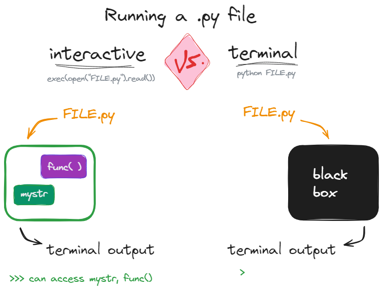
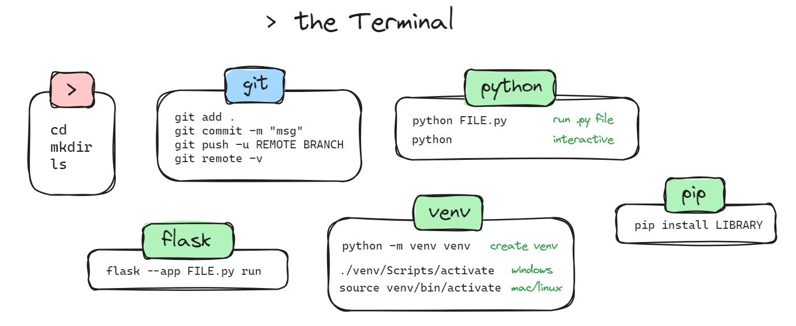
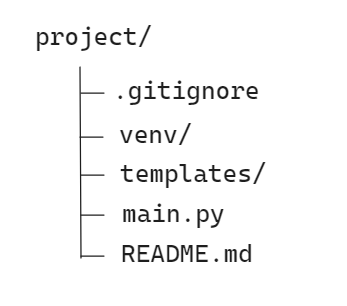
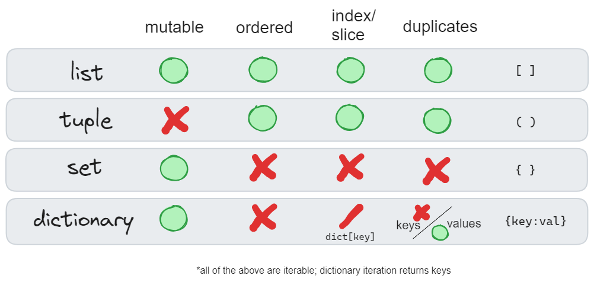

## Week 4
- discussion/news
- assignment check-in
- weeks 1-3 recap
- week 4 material
- group time (time permitting)


---
## Assignment Discussion
- Flask app part 2 (login)

- Pair Exercise #2 (strings, lists, dictionaries)

---
## Flask App Part 2
Navigation issues (i.e. seeing wrong screen)
- part 2 added a /login url and /welcome url, but did not change the default url /. 
- @app.route("/") bound to http://127.0.0.1:5000.  This is the default page that is served.
- @app.route("/login") is accessed at http://127.0.0.1:5000/login. Just need to navigate to that url to see the new code.  

You can also use _localhost_ in place of 127.0.0.1 above as that is always the address of the localhost.

---
## Flask App Part 2, cont'd
Issue with code execution: returns an error while all code is correct. 

Opening the .py file in IDE shows an import issue with flask, even though flask is installed and virtual env active.

Windows powershell - check your code execution policy:
`Get-ExecutionPolicy`

You want this to read "RemoteSigned" to be able to execute scripts. Open powershell with admin privileges (right-click, run as admin):
`Set-ExecutionPolicy RemoteSigned`


---
## Play button in VS Code


- 'play' button in VS Code to run python files may result in: 
_"requires ipykernel and pip package..."_

switch from 'run in interactive' to 'run in terminal'

. . ._what is the difference?_

---




---
# Recap, weeks 1-3
- navigating the terminal, commands

- building a project workspace
- python data types
- python control flow structures

---


---
# Building your workspace
Which dir do we want to be in when running _most_ terminal commands?


---
### Python Data type characteristics
- **subscriptable**: composed of smaller python objects
- **mutable (immutable)**: can (cannot) be changed in place
  - make use of the same (different) memory space when performing operations
- **ordered**: the order of objects matters (access by offset)
  - indexing: `myobject[3]` 
  - slicing: `myobject[2:5]`
- **unique**: does it accept duplicate values?
---


---
### String Highlights
- wide variety of formatting methods and functionality
- can access chars via offset, `mystr[1]`, or slice, `mystr[3:]`
  - copy with slice: `mystr[:]`
  - reverse with slice: `mystr[::-1]`
- break apart string into list: `mystr.split()`
- search
  - using in: `"ca" in "shopping cart"`
  - using .find(): `mystr.find("TEXT")`
  - using .count(): `mystr.count("TEXT")`

---
<style scoped>
{font-size: 30px;}
</style>
### List Highlights
- versatile, lots of functionality
- hold any object type, each item can be different
- can nest them
- support access and _assignment_ by offset
- selected methods: 
  - `.pop()` : return the last item and remove it from the list
  - `.sort()` : sort in place (edits the object)
  - `.insert()`, `.remove()`
- support comprehensions (construction using expressions within square brackets)
  - [_expression_ for _item_ in _iterable_]

---
### Dictionary Highlights
- structured like a lookup table
  - key: value pairs
- access using keys
  - `d["name"]` returns value stored in key "name", exception if not
  - `d.get("name")` returns value, otherwise _None_
  - `"name" in d` returns True or False
- can hold any object type, can be nested
- support comprehensions
  - {_key_expression_ : _value_expression_ for _expression_ in _iterable_}

---
### Set Highlights
- unique items, do not store an order
- use to compare membership (set operations)
  - union, intersection, difference, etc.
- use to get unique values from other objects
- combine with len() function to count unique elements
  - `len(set(mylist))` returns # of unique items in object _mylist_

---
### Loops and Control flow
- **if**: `if` _condition_ `:` _code to execute_
  - combine with `elif` _condition_ `:`  for multiple match conditions, or `else:` to define code to execute if False
- Loops
  - **for**: `for` _var_ `in` _iterable_ `:` _code to execute_
  - **while**: `while` _condition_ `:` _code to execute_
  - additional control with `break`, `continue`, `else`
- can nest / combine these statements
- can iterate over objects, or construct with `range()`

---
## Week 4 topics
- functions in python

- python objects & classes

- what is programming


---
<style scoped>
{font-size: 60px;}
</style>
We've learned about basic data structures and control flow, now we want to focus on 

_Structuring reusable code_

---
<style scoped>
{font-size: 80px;}
</style>
## The need for functions

---
 <style scoped>
 section {columns: 2; display: block; }
 h1 { column-span: all; } 
 h2 { break-before: column; }
 </style>

### You have a script
coin_flip.py w/ the following contents:
```
from random import randint

flip = randint(0,1)

if flip == 1:
  print("Heads")
else:
  print("Tails")
```

#### How python executes
When the file is run, python:
- traverses the file top to bottom, left to right
- lines are always executed in the order they are written


---
Continuing with the previous example we now want to:
- print a message after the flip, then
- flip another coin 

With the tools we currently have, we'd have to simply add code to the end of our file that:
 - prints the desired message, 
 - re-type (copy/paste) the coin flip code

---
### What we need: a way to have python run code located in other places. 

---
## Functions
**Functions** are self-contained pieces of code that are ___defined___ (how they work described in code) and ___called___ (executed). 

functions are declared with the `def` keyword:
```
def myfunc():
  print("your function ran")
```
As with other statements, function definition statements use `:` to denote the end of the _def_ and the start of (indented) code that comprises the function

---
<style scoped>
 section {columns: 2; display: block; }
 h1 { column-span: all; } 
 h2 { break-before: column; }
 </style>

### New script w/function
coin_flip_func.py w/ the following contents:
```
from random import randint

def coinflip():
  flip = randint(0,1)

  if flip == 1:
    print("Heads")
  else:
    print("Tails")
```

#### How python executes this file
- traverses the file top to bottom, left to right
- def statement instructs python that a function is being defined
- the function code is read and associated with the function object _coinflip_
- the function code does not execute
---
### Function effects: terminal and python session
_Run the **coin_flip_func.py** file in both terminal and python interpreter_

Terminal: `python coin_flip_func.py`
- compare the resuts to the prior **coin_flip.py** results

Python Interpreter: `exec(open("coin_flip.py").read())`
- investigate named objects in python session: `dir()`

---
## Executing function code: Function Calls
Functions in python are immediately parsed line by line and their code loaded into the namespace.

The function code itself is not executed until it is _called_. To call a function, use the format:

`myfunc(args)`

**coinflip()** is an example of a function that takes no arguments (no args passed in to the function)

---
## Function Arguments

_Arguments: objects passed to the function for use in executing the function's code._

`myfunc(args)`

**Arguments vs. Parameters**
Arguments and parameters used interchangeably,  arguments refer to what the function requires and parameters are what they are called when accessed inside the function (values of arguments).

---

Let's add an argument to the coinflip function:

```
from random import randint

def coinflip(num): 
  
  for x in range(num):

    flip = randint(0,1)
    if flip == 1:
      print("Heads")
    else:
      print("Tails")
```

Now we can pass in an integer to run the coinflip() function that many times: `coinflip(12)`

---
###  Return: what happens when a function terminates
- All functions return an object when done executing
- Functions without _return_ statement return a `None` object
- Return allows you to specify what object is returned
- Return will terminate function execution when encountered

To use the results of a function call elsewhere in your code, _assign the function call to a variable._

In our coin flip example: `x = coinflip(4) ; type(x)`

---
Let's say we now want to track all the coin flip results and return them as a list of 0's (tails) and 1's (heads). (coin_flip_ret.py)
```
def coinflip(num): 
  flip_results = []

  for x in range(num):
    flip = randint(0,1)
    if flip == 1:
      print("Heads")
    else:
      print("Tails")

    flip_results.append(flip)
    
  return flip_results
```

---
With our latest changes, assigning a variable to the function call will allow us to return the list of results:


`x = coinflip(32)`

We now have a _list_ object `x` in our environment that we can use for future manipulation.
 - count # of heads (sum)
 - % of heads (sum/len)

---
### Function recap
- functions encapsulate code and allow it to be executed on command
- functions are objects
- Python divides functions into 2 parts:
  - definition (load the code as named object): `def myfunc():`
  - call (run the code): `myfunc(args)`
- Can specify arguments that the function can utilize in its execution
- return keyword terminates a function and returns an object to the calling environment

---
### Types of function Arguments
Standard function definition: 
`def func(arg1, arg2)`

Arguments in this format are REQUIRED; missing arguments throw an error
  - **positional**: arguments required, entered by position and the order must be preserved. Call syntax: `func(10, 5)`
- **keyword**: arguments required, use argument name to define - can be passed out of order. Call syntax:  `func(arg2=5, arg1=10)`

---
### Default arguments
Function definition using defaults for arg2: 
`def func(arg1, arg2=None)`

- **default**: function def can specify default values to be used if an argument is missing from the call. 

_arg1_ is required
_arg2_ is not required (None passed in by default)
Valid calls:
- `func(10, 5)`
- `func(10) # no error thrown for missing arg` 

---
### Optional arguments
- **optional positional**: pass in any number of args as a _tuple_ 
  - Def format: `def func(*args)` 
  - Call: `func(1,2,3,...)`
  - call passes in the tuple (1,2,3,...)
- **optional keyword**: pass in any named args as a dict 
  - Def format: `def func(**kwargs)` 
  - Call: `func(cost=12, item="vase")`
  - call passes in the dict {"cost":12, "item":"vase"}

---
Optional keyword example (dictionary parameters)
```
def func(**kwargs):
  dict = kwargs
  print(f'the {dict["item"]} costs {dict["cost"]} dollars')
```

call: `func(cost=12, item="vase")`

---
### Code execution with functions
_Now that we have functions, code order does not matter, right?_

Functions allow execution of code in a specified order, but a function must first be defined before it can be called. 

A function call in a script before its def statement will raise an error (name is not defined).

Functions can (and often do) call other functions within their scope. Function calls must still come after the function def in these cases.

---
<style scoped>
 section {columns: 2; display: block; }
 h1 { column-span: all; } 
 h2 { break-before: column; }
 </style>
### Invalid
```
my_func()  # function call

def my_func():
  print("i ran this function")
```

```
def main():
  my_func()

main() # not yet seen object my_func

def my_func():
  print("it ran")
```

### Valid
```
def my_func():
  print("i ran this function")

my_func() # function call
```

```
def main():
  my_func()

def my_func():
  print("it ran")

main()
```


---

### Functions as arguments
Remember that:
- functions are objects
- any object can be an argument

Therefore, you can pass a function as an argument to another function. 

---
Can create a 'wrapper' function (function that wraps around another function) to call any function along with optional arguments:
```
def callfunc(func_to_exec, *args):
  func_to_exec(*args)  
```

Now you can run `callfunc(coinflip, 13)` to have _callfunc_ execute the _coinflip_ function with the specified argument.

---
### Decorators
Similar to the prior wrapper function, decorators are functions that take a function as input and return another function. 

Allows you to run a function within another function using the syntax:

```
@decorator_name
def mymult(a, b):
  return a * b
```

Calling `mymult(2, 4)` will run the _mymult_ function by passing it to the _decorator_name_ function.

---
You've already seen decorators in action - in Flask assignment #2.

@app.route() decorator used to run flask function that binds the subsequent function to a url location. 

Note that decorators:
- do not alter the functionality of the functions they call
- add functionality

---

### namespaces
Exactly as it sounds: Name Spaces, or what python is keeping track of as named entities (objects, methods, properties).

- scopes within which named objects are unique
- when there is a conflict, priority given to most local scope

_scope examples: function, file_
```
msg = "global message"
def print_msg(text=msg):
  msg = "local function message" # local msg; use 'global msg' to use global 
  print(msg)
```

---
### Looking at namespaces

- `dir()` : return all properties and methods of an object
- `globals()`
  - dictionary of global namespace objects and their values
  - `globals().keys()` has same items as `dir()` from interactive session
- `locals()`
  - dictionary of local namespace objects (within calling environment)

---
<style scoped>
{font-size: 33px;}
</style>
### Exceptions
Exceptions trigger an error and stop the execution of a program. 
Most basic use of bulit-in exception class:
```
if some_condition:
  raise Exception("your message")
```
Can also use _try_ and _except_ blocks to attempt code in the _try_ block:
```
try:
  my_string = "rain"
  my_string[45]
except Exception as exc:
  print(exc)
```

---
## Objects and Classes
A class is a _template for creating objects_.

A **class** defines a set of attributes that will characterize any **object** that is **instantiated** from the class. These attributes include data (class variables, instance variables) and methods (functions).

Now that we have data structures and functions, we can combine them to create more permanent objects that can have their own data along with their own functions (called methods).

---
### Class nomenclature
**class**: code that defines an object

**object**: entity with attributes (data) and methods (functions)

**instance**: object created from a class template

**method**: function defined within a class

**attributes**: named data fields associated with a class object (instance)

---
<style scoped>
 section {columns: 2; display: block; }
 h1 { column-span: all; } 
 h2 { break-before: column; }
 </style>

## What a class definition looks like
```
class Tree():
  def __init__(self, name="Fir", height=3):
    self.name = name
    self.height = height

  def water(self, gallons=10):
    self.height = self.height + gallons * .15
    print(f"I grew! I am now {self.height} feet.")
    self.talk()

  def talk(self):
    print(f"I'm a {self.name} tree. \
    Nice talking to you.")
```

#### Class coding
- define with `class NAME:` 
- `__init__` runs when an instance is created
- methods are just functions
- methods accessing attributes need _self_ as the first arg
- _self_ is the instance (object)
- attributes referenced in a class using dot notation: self.attr

---
### Self is weird. What is it?
Inside a class, methods use self to reference that particular instance.

Outside the class, method _calls_ are attached to an instance object using dot notation: `instance.method(args)`
Sample method call syntax (notice the instance object _mytree_ is substituted for _self_): `mytree.water(20)`

When a method is called, Python takes the instance object and passes it as self to the function being called along with the remaining arguments.

When you see self, think ***instance*** (a particular class object).

---
### Inheritance
The () in a class definition can be used to specify a _parent class_. A subclass, or child class, will inherit all the methods of the parent class.

Why is this useful? 
- quickly build similar classes
- re-use your existing classes
- add only where you want them to differ

Subclass methods will overwrite superclass (parent class) methods - ***local over global***

---
### Inheritance example

```
class DeciduousTree(Tree):
  def __init__(self, *args):  #args are optional
    super().__init__(*args)  #call Tree __init__ with *args
    self.canopy = 100

  def winter(self):  #New method for this subclass
    self.canopy *= .25
    print(f"It is winter and my canopy is at \
    {self.canopy} percent of its former grandeur.")

  def talk(self):  #Override the parent method
    print(f"I'm a deciduous {self.name} tree. \
    Do you have any leaves for me?") 
```

---
### Dataclasses
Alternate way to code classes, more focused on the data aspect of classes (attributes, objects as data containers)

```
from dataclasses import dataclass
@dataclass
class Tree:
  name: str = "Fir"
  height: int = 0
  canopy: int

  def talk(self):
    print(f"I am a {self.name} tree that is {self.height} feet tall.")
```

---
## Import: using code in other files
The _import_ statement loads the named file into the current environment. It only does this once: multiple import statements will not do anything.

`import FILENAME` #no .py  extension

To call a function in FILENAME, you need to use dot notation:
`FILENAME.FUNCTION()`

---
### Import example

```
>>>
import class_tree #no .py
dir()  #class_tree is added to namespace, but not individual funcs
dir(class_tree)
t = Tree() #try to access the Tree class in class_tree
t = class_tree.Tree()
```

---
### Other import options
#### Import only specified objects (funcs and classes are objects)
- from FILENAME import OBJECT 
- example: `from class_tree import Tree, DeciduousTree` 
- access directly without the `.` notation: `t = Tree()`

#### Import ALL objects in a file
- `from FILENAME import *`
- usually not desirable
- FILENAME itself not in namespace, all objects defined within are

---
### Execute a file
**exec(open("FILENAME.py").read())**

All code in the file is executed: function and class objects will be assigned (created) in the namespace as they are encountered.

- function calls similar to _from...import_ in terms of naming (no dot notation)
- re-executes the code each time it is run
- confined to local scope (calling env't); import is global

---
### Module, Package, Library
**Module**: a single .py file.

**Package**: a collection of modules in the same directory. Contains an `__init__.py` file in the dir

**Library**: collection of packages and modules.

---

[Programming as Theory](week04_slides_Naur.md)