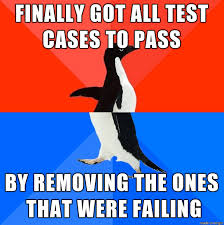
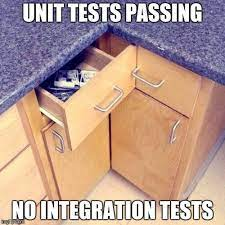
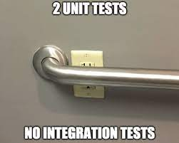
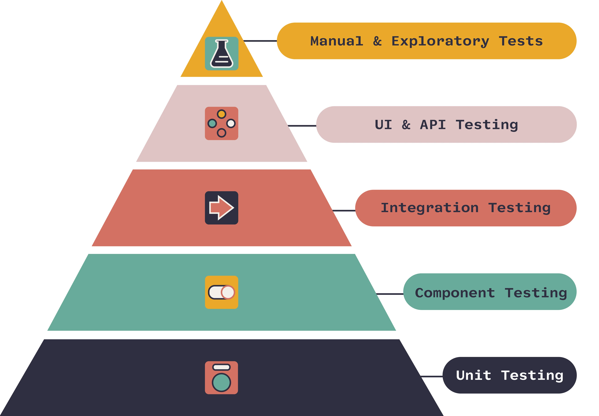
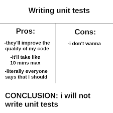
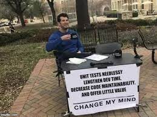

## Agenda
- news/discussion
- homework
- group projects
- Okken (roughly ch 1-3) - Pytest
- P & M chs 5 & 6

---


---
## Homework Review
### Pair Programming Exercise #2 (due last week), 
**Questions 2 & 3:**
Print **"Hello, World!"** and **'Hello, World!"**

This was the _intended output of the print() function_

Q2: would need to use single outer quotes:
mystr = `'`"Hello, World!"`'`

Q3: would need to escape using \
mystr = `'`\\'Hello, World!"`'`

---
## Pair Programming Exercise #3
Thoughts?

Look at the test file?

Experiences with pair programming?

---
## Group projects
Full Rubric Available (all parts)
- github
- canvas

Upcoming group deadlines:
- Part B due Feb 26 (2 weeks)
- Part C due March 12 (4 weeks)
  - First code demo
  - Class Presentation

---
## Other Upcoming Assignments

Flask Part 3
- individual assignment
- due next week (2/26)

---
# Testing


---
## Testing in software development 
The process of verifying that a software product meets the requirements and expectations of its users and stakeholders. 

## Why test?
- identify bugs in development
- improve code quality
- verify your software is reliable
- ensure your software meets user requirements and expectations

---
## Benefits of testing

- increase customer satisfaction
- reduce development and maintenance costs
- enhances security and reliability
- facilitates continuous improvement and innovation

---
## Types of tests
Testing in development
- **Unit test**: checks a small bit of code, think function or class 
- **Integration test**: test how components work together. larger than a unit test, smaller than a system test (i.e. several classes) 
- **System test** (end-to-end)
  - checks all of the system in an environment as close to the end-user environment as possible
  - make sure software meets specified requirements

---
## Illustrating test types, specimen #1
Individual drawers (unit) working, but...

How do the pieces/units fit together (integration)


---


---


---


---
## Types of test, cont'd
Testing after development
- Acceptance testing
  - validate whether the software aligns with customer expectations
  - involves stakeholders and clients
  - purely functional testing
  - black box (no access to source code)

---
## How many tests to write?
no objective answer

General guidance:
- write tests at different levels:
  - write lots of small and fast unit tests
  - write some coarse-grained tests 
  - write a few high-level tests that test your application from end to end

---
## Testing triangle (OG)


---
## Testing triangle, updated for app


---
### Now know:
- why to test
- various types of tests
- what a good mix of tests looks like

So how do we write them?

---
## Anatomy of a test
#### Arrange, Act, Assert
- **Arrange**: set up the conditions for the test
- **Act**: call some function or method
- **Assert** that some end condition is true

---
### Writing a test
Example 1 (no pytest). Consider a function that adds two integers:
```
def add(a, b):
  return a + b
```
And a simple test:
```
#test
def addtest():
  assert add(5,10) == 15, "add function error; 5+10 should be 15."
```
_what else could we do in addtest?_

---
## You try!

Consider a function that calculates the volume of a rectangle:
```
def volume_rect(l, w, h):
    return l * w * h
```
take a few minutes and write your own function that tests volume_rect().

think about various conditions you would want to test.

---
## Compare your test code with classmates

- how did they differ?
- what can you learn about code assumptions? 
- do you think code and tests should be done by one individual?


---


---
## Organizing your tests
Where to write them?

Sample before had test code mixed in with regular code (same file).
This works, but...


- hard to maintain test code (find, edit, update)
- lengthens and clutters your actual codebase

#### Create a 'tests' directory in your project dir

---
## Testing in Python

We'll be using Pytest

There are a number of other frameworks (unittest is the built-in one)

All have their pros and cons, feel free to explore others


---
## Why use a testing framework?
**What is it?** 
a library that helps you write and run tests. 

**We just wrote some killer tests, why do we need it?**
makes your test writing easier, more organized, and more efficient

**Why Pytest?**
Simple yet extensible, with many features

---


---
## Pytest features (that may change his mind)
- automatic test discovery
- simple assert statements
- detailed failure messaging
- reusable test data/resources (fixtures)
- run same tests easily with different data (parametrization)
- filter tests/select tests to run (markers)
- extendable/modifiable (many plugins to enhance functionality)

---
## Pytest: what we'll cover
- installation
- basic test writing
- explore the benefits (if any)

---
## Installing pytest
- create/activate venv
- `pip install pytest`

To see packages installed (in active virtual envt): 
terminal > `pip list` 

---
### Basic Pytest test writing
How do you write a test in Pytest?

_You write regular python code_

- name your function with the "test_" prefix
- use python's _assert_ keyword along with your condition: \
`assert CONDITION`

---
# A Simple Pytest test

```
def test_permapass():
  assert 1 == 1

def test_permafail():
  assert 2 > 300
```

Same look as the non-pytest tests

Only difference is the "test_" convention for naming...
...BUT, you get a lot of extra functionality for free!

---
# Advantages of Pytest


---
## Automatic test discovery

- Pytest can find and run tests automatically
- do not need to import test modules or classes
- just run `pytest` from the terminal
  - with no arguments, looks in current dir and all subdirectories for tests to run
  - looks for files with "test_" prefix, functions with "test_" prefix

_test_dir > `pytest`_

---
## How would you find tests without pytest?
Would need to:
- know the names of your test **files**
- know the names of the test **functions**
- maintain a script to run them all


---
## Pytest uses standard Python _assert_ statements
Python assert statement: `assert CONDITION, "optional error message"`
- If an assertion fails (evaluates to False), Python raises an AssertionError
- ensure certain conditions remain true

Summary: Pytest uses plain assert statements to check the expected outcomes of tests, without requiring special methods or classes

---
## Detailed failure messaging
we have custom error messages with standard python assert...why use pytest?
- pytest summarizes all test results
- pass and fail counts
- green dot for each assertion passed, red "F" for each fail
- detailed error messages include expected and actual values for failed assertions

_compare custom user message to pytest (test_basic.py)_

---
## Reusable test data/resources: Fixtures

Use fixtures to create test objects, data, or state setup for use in tests
- create with decorator @pytest.fixture, followed by function def
- used in a test function by passing the fixture as an argument
```
import pytest
@pytest.fixture
def example_fixture():
    return 1

def test_with_fixture(example_fixture):
    assert example_fixture == 1
```

---
### Run the same tests with different data: Parametrization
Allows you to run the same test with different input values and a single test (instead of multiple tests)

**Example**: We have a function _is_palindrome_ that takes a string and returns True if it is a palindrome (a word spelled the same backwards and forwards) and False otherwise. Standard python test code:
```
def test_palindrome():
  assert is_palindrome('tacocat') == True
  assert is_palindrome('taco') == False
  assert is_palindrome('ada') == True
```
---
## Parametrized code
use the @pytest.mark.parametrize decorator:

```
@pytest.mark.parametrize("test_input, expected", 
                        [('tacocat',True),
                         ('taco', False),
                         ('ada', True)])
def test_palindrome_par(test_input, expected):
  assert is_palindrome(test_input) == expected
```

_more useful the more test conditions you have_

---
## Filter tests/select tests to run
**Directory scoping**: By default, pytest will run only those tests that are in or under the current directory.

**Run specific file**: `pytest TESTFILE.py`

**Markers**: Pytest can use markers to specify tests to run, tests to skip
- can define custom markers (keywords)
- Mark test functions with decorator: @pytest.mark.MARKER
- Run tests with that marker: `pytest -m MARKER`

---
## Pytest Built-in Markers
**skip**: `@pytest.mark.skip`

**skipif**: `@pytest.mark.skipif(CONTITION, reason="needs person class")`

...and many more (including parametrize, xfail)

Gotta see 'em all!
`pytest --markers`

---
## Extending Pytest: Plugins
Pytest can use plugins to extend its functionality or integrate with other tools, such as coverage, mock, selenium, etc.


pytest-cov 
https://pypi.org/project/pytest-cov/

---
## Practice

Put the following code into a new .py file and write a test for the following function:
```
# caution...mutable objects ahead

def reverse_list(list: list):
  list.reverse()
  return list
```

---
## More info on testing in Pytest
Pair Exercise 3 - take a look at the **test_pe3.py** file

You'll see examples of most of what was covered here (and it will make much more sense to you now!)


---
###  What about the pytest.ini file?
Configured some options

addopts = -v --tb=short
- -v means verbose mode, which includes information such as test names, outcomes (pass/fail), and any captured output
- --tb is traceback (error stack trace), short is concise traceback that shows only relevant lines of code and error messages without excessive details

It also defined custom markers that ignored the usual warning message that goes with custom marks `@pytest.mark.CUSTOM`

---
# Pilone & Miles Chapter 5: Getting it done with great design


---
## Designs get better through...
iteration, **refactoring**

refactoring
- modifying the code structure without modifying behavior
- can increase code cleanliness, flexibility, extensibility

---
## Single Responsibility Principle (SRP)
***every object in your system should have a single responsibility***
- all of an object’s services should be focused on carrying out that single responsibility
- Implementation correct if each object has only one reason to change

_where have we heard this before?_

---
## Identifying multiple responsibilities
“The _class_  _method’s_ itself.”

Good example: “The automobile _starts_ itself”

Bad example:  “The automobile _washes_ itself”

---
## Correcting Multiple Responsibilities
Make new classes for methods that don’t belong
- a CarWash class for the entity that washes cars
- a Gardener class for pruning and watering Trees

---
## DRY (Don't Repeat Yourself)
Avoid duplicate code by placing common functionality in a single location
- abstraction (think get, post put for http requests)
- split/separate code 
- each behavior in a single, sensible place

---
## "Good Enough"
- Refactor when code can be improved in a way that _gets the project done faster_
- Don’t improve code for the sake of improvement
- Getting what the customer wants done when they want it is top priority

---
### Plan the Unplanned
- add them to the big board 
- estimate, assign, work on them

**Don't count only programming time!** All work should be included in your burn-down. Remember to plan for:
- meetings with stakeholders
- demos
- any other miscellaneous duties

---

## When everything is complete
- The iteration is done
- may be some tasks not quite finished - move to next iteration


---
# Pilone & Miles Chapter 6: 

# Defensive Development


---
# Version Control Software
- aka Configuration Management (CM)
- Software that keeps track of changes to files
- enables multiple developers to work in parallel with reduced risk of undoing each others’ work

This is Git

Combined with a server to store shared codebase remotely (i.e. Github)

---
### Conflicts
There are times when changes are not able to be resolved by VC software

In these cases you have to manually resolve the issue by either combining the changes or selecting one over the other.

---
<style scoped>
{font-size: 30px;}
</style>
### Branching
_A branch is a separate version of the codebase that is up to date at the time of creation, but is then worked on separately from development on the main trunk._

Consider branching when:
- there is a released version of the software that must be maintained outside of normal development
- need to try radical changes to the code that would impact regular development

Do not branch when:
- code can be split into different files/libraries
- the only problem is people breaking each other’s code

---
# Upcoming assignments
Flask Part 3
- individual assignment
- more time consuming than prior Flask assignments
- the only assignment due next week
- should help a great deal with your team projects

