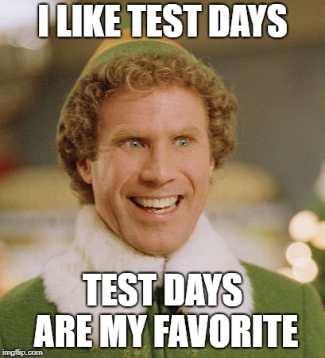
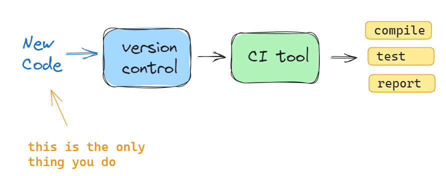

## Week 9 Agenda
- Team projects
- Lecture
   - P & M Ch 7-8 
   - Janzen, D., & Saiedian 2005
- In-class team assignment (due @ 10:15)

---
# ACM Resources
**ACM = Association for Computing Machinery**


- [ACM digital library, free access for period 1951-2000](https://dl.acm.org/)
- [Communications of the ACM (open access)](https://cacm.acm.org/)


---
# Team Projects

### Great job on the presentations!!

- Grades posted along with peer feedback summary
- Be on the lookout for a message in your canvas group page from your "client"

#### Reminder: Team projects due 4/23

---
.
.
.
# News/Articles

---

# P & M Ch 7: Testing and Continuous Integration



---
### Things will inevitably go wrong...

- code changes
- dependency changes
- inscrutable bugs
- many, many more...

#### Can't control or predict all of those factors...Control your approach!

---

#### Three ways to view your codebase:
1. **User**
    - 1,000 ft view
    - focused on functionality
2. **Tester**
    - see some internals
    - database, connections, memory
3. **Developer**
    - everything (coding, design, theory)

---
### Black-box testing: View from Outside
- only functionality is visible
- user input validation
- output
- state transitions
- edge cases

Like viewing the International Space Station (ISS) from outside

---
### Grey-box testing: Some guts
- auditing and logging
- intermediate data
- communication with other systems
- system-added information
- other cruft lying around

Walking around the inside of the ISS

---
### White-box testing: full access
- testing all branches of code
- error handling (safe handling, proper messaging, etc.)
- working as documented
- testing code with other code

Hooked up to a terminal within the ISS

---
### Don't wait for changes to break things -  Plan ahead 
- build up a suite of tests
- control when/which tests get run
- automate with a testing framework

---
### Continuous Integration
Comprised of:
- version control
- automated builds
- automated tests



---
# Having tests guarantees everything will work!


---
# Not quite...
- your working code may not be what the customer wants
- Automated tests may not work well for some aspects (UI)
- can be difficult to select which tests to write
- how much of your code is tested? (this is referred to as _code coverage_)

---
# Be Prepared
- good testing takes time
- testing code is code to write 
  - this is dev time
  - include it when calculating work time
- 100% coverage not practical, aim for 85%
- Monitor rate of bugs
  - esp before/after release

---
# P & M Ch 8: Test-Driven Development

I used all my testing memes back in week 5 :(

check https://devhumor.com/ if needed

---
## Test-Driven Development (TDD): process overview
1. determine a task to work on
2. write a test that your code would have to pass in order for it to accomplish the task
3. write minimum code needed to pass the test
4. refactor if needed

 ...start the process again

---
## Test-Driven Design Rules
**RULE #1:** your test should always fail before writing code

**RULE #2:** implement the simplest code possible that will pass the test

Remember **YAGNI** - "You ain't gonna need it"

TDD Process overview: 

`RED` ----------> `GREEN` -----> `REFACTOR`
_failed test_ -> _passed test_ -> _refactor_

---
## TDD Principles
- create tests, then code, for specific functionality
- anything beyond that functionality is not important
- each test should verify ***one thing***
- keep your test code organized
  - helps avoid duplicate tests
  - mirror your code structure 
  - keep test code separate from code
- once tests pass, move on

---
## Code Dependencies in Test-Driven Devlopment
- Not always able to code just one piece of code
- in TDD, other code may not exist yet (for example if it wasn't needed to satisfy existing tests)
- writing minimal code to satisfy tests does NOT include all the other supporting code

#### So, what to do?

---
## How to deal with tasks that have dependencies
- loosely couple your code (reduce level of dependency as much as possible)
- mimic functionality that other code would have
- create fake objects and/or database connections to serve as placeholders
- use temporary solutions

---
## Strategy pattern
- multiple implementations are accessible through a single interface

**Applied to TDD, you can split your implementations to deal with dependency issues**
- one implementation for testing
- separate implementation for production code

---
#### Strategy pattern example: database connection
```
class Database:
  def connect(self):
    pass

class TestDatabase(Database):
  def connect(self):
    return "Connected to test db"

class ProductionDatabase(Database):
  def connect(self):
    return "Connected to production db"

db = TestDatabase()
db.connect() # run the connection code depending on object class instantiated
```

---
## More tests = more code
- automated TDD requires a LOT of test code
- can save some time with mock objects

Seen these before - **Fixtures** in pytest (test_pe3.py):
```
#fixture for creating Account objects
@pytest.fixture()
def create_objects():
    a = BankAccount("X Abc", 1234, datetime.date.today(), 500)
    b = CheckingAccount("X Abc", 1234, datetime.date.today(), 500)
    c = SavingsAccount("X Abc", 1234, datetime.date.today(), 500)
    return [a, b, c]
```

---
## Good software is testable
This is true whether you are using TDD or not

Testing tips:
- try for relatively complete coverage
- use automated tools
- don't write unnecessary tests
- refactor to improve code

---
## Common Testing Pitfalls
- partial adoption (some members of team adhere to team testing guidelines)
- a poorly maintained test suite
  - not updated frequently
  - can result in unnecessarily long running times
- an abandoned test suite (seldom or never run)
  - results in poor maintenance
  - often a result of turnover

source: https://www.agilealliance.org/glossary/tdd/

---

# Readings
- Janzen & Saiedian (2005)

---
# Janzen & Saiedian (2005)
-
## Test-Driven Development: Concepts, Taxonomy, and Future Direction
-
Attempts to outline what TDD is and isn't

---
## TDD is more than testing
- write automated tests of the "units" of the code
- unit tests are written as code and placed in a testing framework
- likely need to create mock/stand-in objects to support unit tests

Key difference from traditional testing:
- developer writes tests ***before*** the code
  - traditional testing can be done long after the code is written, possibly by someone other than developer

---
## What is TDD?
**It is NOT:**
- a testing technique (i.e how to write tests)
- a software development methodology

**It IS:**
- a practice that can be used along with others
- a tool that can aid in analysis, design, and programming
- a way to ensure tests are written (and kept after they have been passed)

---
## Research Results
Paper presents outcomes of projects using TDD from:
- 3 industry studies
- 5 academic studies

**CODE QUALITY IMPACT**: 4/8 (50%) show improvement in test passing, defects, reuse, or information flow

**PRODUCTIVITY IMPACT**: 6/8 (75%) show improved or similar productivity to non-TDD

---

# In-Class Exercise


Get some practice:
- writing code based on a description
- writing tests based on code specifications (no access to code)
- using TDD (writing a test for non-existent function)

---
## Review for in-class exercise

Week 5 covered testing...**that was a month ago!!**

Review some of the basics

---
## Anatomy of a test: Arrange, Act, Assert

**Arrange**: set up the conditions for the test

**Act**: call some function or method

**Assert** that some end condition is true
- syntax: `assert CONDITION`

---
### Basic test writing (Pytest compatible)
- write regular python code
- name your functions with the "test_" prefix
- name your test files with "test_" prefix or "_test" suffix
- use python's _assert_ keyword along with your condition

```
def test_permapass():
  assert 1 == 1

def test_permafail():
  assert 2 > 300
```

---
## Use fixtures to manage mock objects
Fixtures are functions that can be passed in to your test functions - can create test objects, data, or state setup for use in tests

- create with decorator @pytest.fixture, followed by function def
- used in a test function by passing the fixture as an argument
```
import pytest
@pytest.fixture
def example_fixture():
    return [32, 100]  # configure your objects and return them

def test_with_fixture(example_fixture):
    assert example_fixture[0] == 32   # write your test using fixture obj
```

---
## Pytest markers
**xfail**: use to indicate a test that SHOULD fail
```
import pytest

@pytest.mark.xfail(reason="Reason of failure")
def test_example():
    assert 0 == 1
```

**skip**: `@pytest.mark.skip`

view all markers (buitin): 
pytest --markers