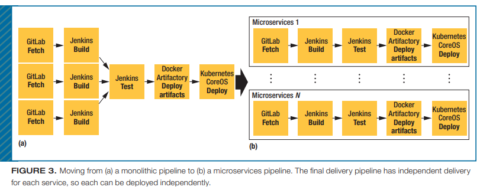
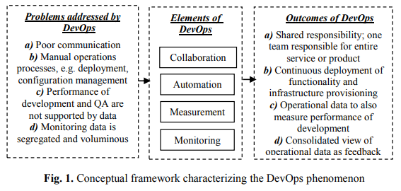
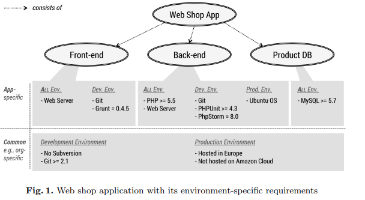

# Week 11 Agenda: Formalizing Agile
- P & M Ch 12
- CI/CD
- DevOps
- Articles
- CI in action

---

#### P & M Ch 12: The Real World: Having a Process in Life

There is no single process that will work for all situations

But, there are things that good processes have in common...

---
### Indicators of a good process
1. Iterative development
   - numerous empirical examples: waterfall production far riskier
   - do not need to wait on that "one key piece" of functionality - simplify and develop other areas of the software
2. Continual evaluation and assessment
   - project will change
   - requirements will change
   - people/team members will often change
   - evaluate your processes and be willing to adjust as needed

---
### Indicators of a good process, cont'd
3. Incorporate best practices
   - be aware of what is available and how it could benefit (or hinder) your project
   - be fair in your assessment of how different methods/processes will affect **the project at hand**

---
### Making changes
When you decide you need to make a change, some things to think about:
- be mindful of **when** you are making changes
   - avoid changing mid-iteration: more disruption than benefit
   - end of an iteration is a natural time for adjustments
- have a way to **measure** if your changes help
  - measure at the end of an iteraation
  - use concrete measures: test coverage, bug counts, velocity, stand up meeting durations, etc.

---
### Making changes, cont'd
- value all **members** of your team
   - "no process can overcome bad people, but good people can overcome a bad process"
   - try for consensus as much as possible
   - value team opinions in considering changes

---

# The End (Pilone & Miles):

## What are your thoughts about the text? 
- level of complexity
- usefulness/helpfulness in your team programming experiences
- relevance

---
## CI and CD: Overview
**Continuous Integration**: describes the use of automated processes in the development of software where all changes are managed, monitored, and tested automatically (**DEVELOPMENT**)

**Continuous Delivery**: expands the use of automated tools to the deployment, operation, and monitoring of software (**OPERATION**)

---
### DevOps: Production (Dev) + Deployment (Ops)

Production/Development:
- Plan
- Code
- Build
- Test
- Release

[Amazon's definition of DevOps](https://aws.amazon.com/devops/what-is-devops/#:~:text=DevOps%20is%20the%20combination%20of,development%20and%20infrastructure%20management%20processes.)

---

---
Sample stack:

---
### Readings
- Balalaie & Jamshidi, 2015
- Chen 2015 
- Lwakatare et al 2015 
- Wettinger et al 2015

---
## Balalaie & Jamshidi, 2015 
### What they looked at:
Refactoring and migrating a mobile back end to microservices architecture

**microservices architecture**: _cloud-native architecture where software systems are a package of small services_

---
## Microservices
Each component/service:
- is independently deployable on a different platform/ technological stack
- can run its own processes (application instances, memory and CPU isolation)
- can communicate with each other via API (REST or RPC, [read about the differences here](https://aws.amazon.com/compare/the-difference-between-rpc-and-rest/))
- is developed by a small team

---
## Migration details
- migrated a relational database (as a service) to microservices
- deployment was done manually
- motivating use case: implement user on-demand chat (difficult to do with relational database)

---

---
### Lessons learned
|Problem |Solution|
|--------------|------------------|
|deployment in development envt difficult: dependent services must also be deployed | put sample deployment descriptions in each file |
|service contracts: changing services that only expose contracts to each other was brittle| tolerant reader design pattern to add graceful handling
|distributed system development needs skilled developers|have team members familiar with type of programming needed|

---
### Lessons learned, cont'd
|Problem |Solution|
|--------------|------------------|
|service development templates are key| use templates with samples of correct implementation reviewed by senior developers|
|microservices not a silver bullet - introduce complexities that can require much effort|made sense for their use case

---
## Chen 2015: _Continuous Delivery: Huge Benefits, but Challenges Too_

#### What they looked at:
Reported on experiences with adoption of CD, including benefits and challenges in a bookmaking company (book as in "bookie", not publishing)

**continuous delivery defined**:
_software engineering approach in which teams keep producing valuable software in short cycles and ensure that the software can be reliably released at any time_

---
### CD pipeline
- **Code commit**: compiles code and executes unit tests on checkin
- **Build**: execute unit tests (again), generate code coverage report, run integration tests, static analyses, build artifacts for use in subsequent stages
- **Acceptance test**: ensure software meets user requirements. Create production-like envt: server config, software deployment and configuration, run acceptance test suite
- **Performance test**: gauge how code changes affect performance
- **Manual Test**: exploratory, business user tests
- **Production**: deploy into production

---
## Benefits reported with CD
- faster time to market
- building the "right" product faster - feedback happens quicker w/automated processes
- improved efficiency: eliminated time needed to manually configure environments 
- more reliable releases 
- code quality improvements (open bug reports dropped by 90%)
- improved customer satisfaction

---
## Challenges
- fit with existing business processes: did not always mesh well
- limited out-of-the-box solutions, requiring significant investment of time and resources to set up
- potential for vendor lock-in
- some applications simply not amenable to CD

---
## Lwakatare et al 2015: _Dimensions of DevOps_

#### What they looked at:
Characterized the elements of DevOps using a literature survey and interviews with practitioners (searched 6 databases for "DevOps", most were from ACM digital library; also incl Science Direct)

**DevOps**: _seeks to extend collaboration of development towards operations, which is responsible for deploying, managing and supporting systems’ performance_

---

---
#### Wettinger et al 2015: _Enabling DevOps Collaboration and Continuous Delivery Using Diverse Application Environments_

**What they looked at:**
How to specify and maintain diverse application environments in DevOps, including those with environment-specific requirements

**Continuous delivery**: _Continuous delivery aims to significantly shorten software release cycles by bridging existing gaps between developers, operations personnel (system administrators), and other parties involved in the delivery process_

---

---
#### Recommendations
How to determine a suitable topology? _AER = application environment requirements_
1. Define constraints that express your preferences for non-functional requirements
   - i.e. 'resilient' for production environments, or 
   - 'minimum resource usage' for development environments 
2. Compare against common requirements, look at the knowledge base of topologies for potential solutions
3. Rank the topologies according to your environment preferences
4. Pick a (or the most) suitable topology

---
## Discussion of Readings
All focused on DevOps

2 readings of each type: 
- business use case/lessons learned
- academic/theoretical explorations of DevOps

---
.

.

## Which type did you find more useful?

Use case or theoretical?

---

.

.

## Would you feel differently if we were looking at a technical component of computing, such as a cryptographic protocol?

---

### We aren't deploying anything in the team projects, so we'll focus on continuous integration -- the development side of things 

---

## Continuous Integration (CI)
Production/Development process:
- Plan
- Code
- Build
- Test
- Release

---
## Continuous Integration: Explore CI using Github actions

Goal is to automate the "Dev" side of things:
1. Code changes
2. Build
3. Test
4. Release

---
## Automate with CI: 
### 1. Code changes

We've covered this one extensively, using version control (git and github specifically)

---
## Automate with CI: 
### 2. Build 

We haven't previously discussed build scripts

**Build scripts**: 
- configure a project (typically a library or an application)
- specify dependencies, repositories, or any other settings
- produces artifact(s) or package(s) for later deployment

---
## Build script: typical contents
- **Fetch Code**: get the latest code from the source control repository
- **Compile code**: compile the code, check the dependencies/modules (imports, etc.)
- **Unit Tests**: automated unit tests are run
- **Linking**: libraries and code files are linked as needed
- **Build Artifacts**: artifacts (like executables or binary files) are built and stored and/or deployed
- **Logging**: logs generated during the build process are archived

---
## Build characteristics 
- build scripts are like snowflakes: each is unique
- typically involve getting code from a source code repository and running a tool to compile and test the code
- traditionally used to create a compressed archive (.ZIP, .TAR.GZ) or executable (.EXE, .BIN, .APP, etc.); increasingly results in a thing to be done, i.e. deployment of a web application.

---
## Builds in the team projects
For purposes of this course, we will focus on the following: 
- fetching the latest code
- checking and installing dependencies
- running tests

---
## Dependency management (Python)
With a virtual environment activated:

`pip freeze` lists all the Python packages you have installed in the current environment, along with version number

`pip freeze > requirements.txt` will pipe the results of the _pip freeze_ command to a requirements.txt file in your project folder
- will use this file in github actions to specify dependencies
- can open & edit as needed (remove unnecessary dependencies, revise version info, etc.)

---

## Additional exercises to hone your build skills (optional)
Create installable packages
- Okken appendix 4: build a python package

Deploy a flask app using free hosting:
- [using render to deploy flask app](https://docs.render.com/deploy-flask)
- [flask docs on deployment](https://flask.palletsprojects.com/en/2.0.x/deploying/)

---

## Follow along in your group repository
For the remainder of the CI material, follow along in your local team project repository:
- identify a team member to push the changes, or
- identify a team member to make edits directly in github, or
- coordinate team members taking turns, or
- do it later

---

### Requirements.txt
If you don't already have a **requirements.txt** in your team repo, go ahead and create one
- from your terminal with `pip freeze > requirements.txt` 
- directly in github

Once created, open and edit the file until satisfied

---
## Directory structure
_requirements.txt will be in the top level, something similar to..._

project/
|.gitignore
|**requirements.txt**
|main.py
|README.md
|templates/
|static/
|...

---
## Automate with CI: 
### 3. Testing
Github actions can run test scripts (execute Pytest), but we need to have a test structure in place

to automate testing, we need to have:
- function/unit tests
- structured test code (directory)

---
### Testing Structure (Pytest)

For each test directory and subdirectory, you need to have an `__init__.py` file (empty file). This prevents issues if two test files have the same name.

**If you don't have a _tests_ directory**:
 create one in your main project directory. Add an empty **__ init__.py** file in that new _tests_ directory.

If you already have a solid test structure you do not need to restructure your repo (it mimics your codebase structure)

---

## Directory
project/
|...
**|tests/** 
||--__ init__.py 
||--test_unit.py 
||--test_func.py 

---

## /tests
This folder is where you will keep all your tests. You can write your new tests here as well as migrate your existing tests here.

---

### Automation with Github actions
- you have your dependencies stored in a requirements.txt file
- you have your test code structured and organized

Now we're ready to set up our first github action!

---

## Github actions are stored in YAML files
[YAML ain't markup language](https://yaml.org/)

YAML is similar to JSON, but more _pythonized_ (indented, uses colons)

Can hold data or config files

---

## Steps to Configure your repo for Action
- in the main project directory, add a **directory** named _.github/_ (note the dir name starts with a period)
- within that dir, add a directory named _workflows/_
- within the _.github/workflows/_ directory, add a YAML file (name it whatever you want, i.e. 'actions.yml')

Go ahead and have someone make that change in your team repo

---
## Where to put your .yml
project/
|.github/
||workflows/
**|||--actions.yml**
|.gitignore
|main.py
|requirements.txt
|tests/

Your repo is now configured to use github actions

---
## What are Github actions?
Github actions are code executions within a github-created environment, triggered by a specified event such as:
- repo push, 
- pull request,
- specified time schedule

GH free tier: 2,000 minutes of actions/month

---
## Features of actions

Github Actions:
- follow the cycle of `trigger event -> create container -> execute action`
- they create container(s) built to your specifications and execute the code within that environment
- do not change anything in your repository by default (they are not operating in the repo environment)
- have a run history available in the 'Actions' section of your repo

---
## Defining actions (syntax)
- `on:` defines the triggering event(s)
- `jobs:` contain named entities that define what OS to run on and steps to execute
- each step has a defined name and associated properties
   - code to run, or 
   - built-in actions to use
- can make use of pre-existing actions:
  - checkout repo code, setup python, etc.

---

## Example YAML
the course github has a sample .yml file configured to test the 'observer.py' file in the _scripts_ dir

[sample yml](../.github/workflows/actions.yml)

---
## Github Actions tab

Allows you to:
- see complete Run history
   - github.com/USERNAME/REPONAME/actions
   - [history of actions in course github](https://github.com/damapak/ist303_spr25/actions)
- Activate/deactivate specific actions
- see performance measures
- search actions run

---

## Testing an Action
- Make sure it is enabled (it will have _disabled_ next to the action name if it is not enabled)
- make a change and push it to the repo to trigger the "on: push" events
  - change the [observer_test.py](../scripts/observer_test.py) so that a test will fail
  - push the change and watch the test run

---

## Final considerations for automated testing
- keep your test codebase organized
- separate as much as possible (across functions, files)
- biggest concern will be the time it takes to run
  - need to think about which tests to run at different points in time
  - consider using a testing framework to control which tests to run (pytest markers, skip, by file name, etc.)

---

### Go forth and migrate (or create) your tests to automatically run!

for more info on github actions, check out the [actions documentation](https://docs.github.com/en/actions)
