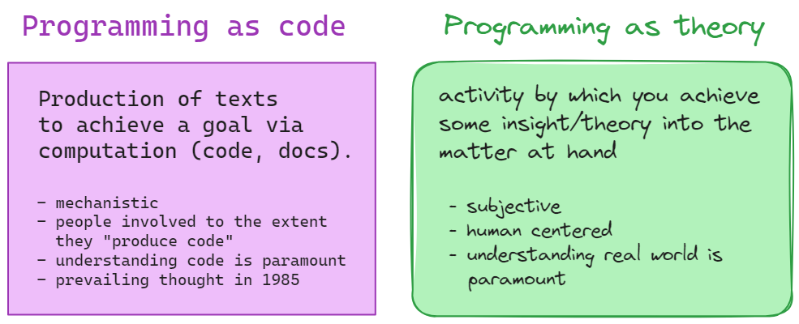

# What is a program?
- code
- documentation

_anything else?_

---
## Naur 1985: Programming as Theory Building

Programmig as defined in the article:
***"the whole activity of design and implementation of programmed solutions"***

Goal:
match significant part of activity in the real world to symbols manipulated by computers

_what if the real world activity changes?_

---

---

### Theory
Theory here is NOT the common interpretation of theory as the most abstract central tenet

Having a theory allows you to:
- support doing with explanations
- answer questions
- provide rationale/justification (argumentation)

Must be able to apply to reality; cannot simply follow rules (reality would give rise to anfinite rule set)

---
### Programmer's role
***Programming***: design & implementation of programmed solutions

***Theory***: knowledge and ideas of how real world affairs will be handled by programs

_What are programmers after?_

[***Programming*** as ***Theory***]

---
### What do programmers need to be able to do?
- explain _how_ the solution relates to real world issue 
  - _which parts of the real world are relevant?_

- explain the _why_ behind each part of the program
  - _which parts of the program match to which aspects of the real world?_

- **ability to respond to modification requests to support the real world in a new manner**
  - _how do you respond to changes in real world conditions?_

---
### Program Modifications

Modifications are  inevitable.

Reasons for modification:
- **insufficiency**: "a program, once in operation, will be found to be only part of the answer to the problems at hand"
- **inspiration**: program use can inspire ideas for further services

---
### Modification costs
Look at costs of various options
- revise existing codebase
- rebuild from scratch
- pre-plan and build flexibility into program

_which of these has the lowest cost?_

---
### All modification approaches are costly
- revise existing codebase
  - more than text manipulation; need understanding
  - not possible to understand theory based on code text and documentation
- rebuild from scratch
  - new theory required
- pre-plan and build flexibility into program
  - assumes predictability of future need
  - must be implemented, tested, etc. for cases that may never arise

---
### Modification Requirements

- "similarity determination": compare existing capabilities to new required capability
- need knowledge of the theory of the existing program
- beyond the scope of rules and criteria (cannot be prescribed)

---
### Evaluation of modifications 
- code correctness
  - does the code work? multiple avenues can deliver same functionality
- theory
  - does the code fit with the theory? fewer avenues that remain consistent with program theory
- comparison of potential paths (chosen solution vs. potential alternatives)
- extent to which programmers possessing the theory of a program remain in charge of it (_where else have we seen this?_)

---
### Modifications and program death
Death of a program happens on dissolution of the team possessing the theory of the program.

Dead progams can contiune to run  - the code may still execute.

Death becomes visible when modification demands cannot be intellegently addressed.

Theory must be rebuilt by a new team.

---
### Conclusions
- Push to elevate programming to much more than text manipulation.
- Respect for the humanity of programmers and the profession of programming as a highly creative and intellectual endeavor.
- Prioritize continuity of the theory (team continuity, passing down of knowledge, cross-training, etc.)

---
# Take heart!
- if you're feeling overwhelmed it's normal!
- software development is not about knowing all the commands and syntax
- human endeavor based on thinking about what you want to do and being able to articulate in plain language
- start with the smallest building blocks of syntax you know - can always optimize later!
- learning with support from others, we all have our own skillsets

---
## Reflection
- What are your thoughts on "programming as theory"?
- Does programming require this deeper connection between the real world and the program code?
- What are the most important skills for programmers to have? 
- Are expert python skills or creativity and understanding the context of real world problems more important? Does your answer differ for 1985 compared to 2020?

_.md document on github to facilitate note-taking on your reflections_
