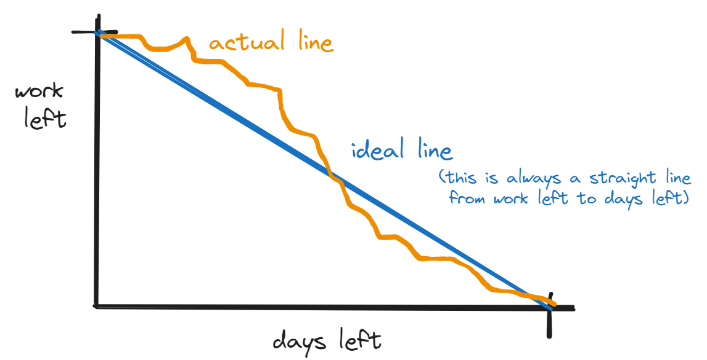
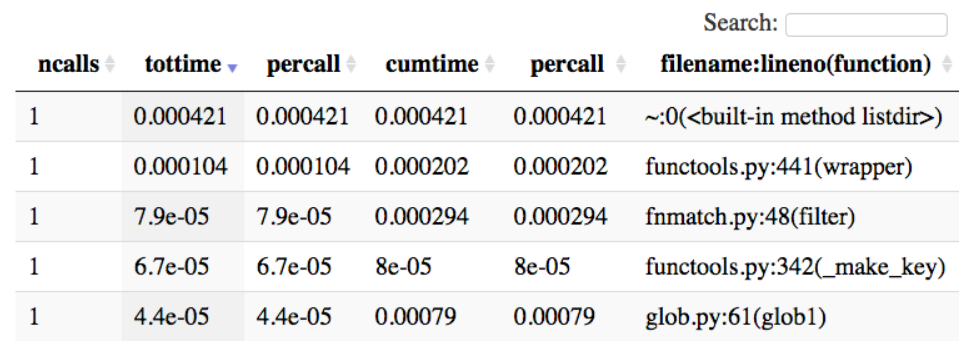
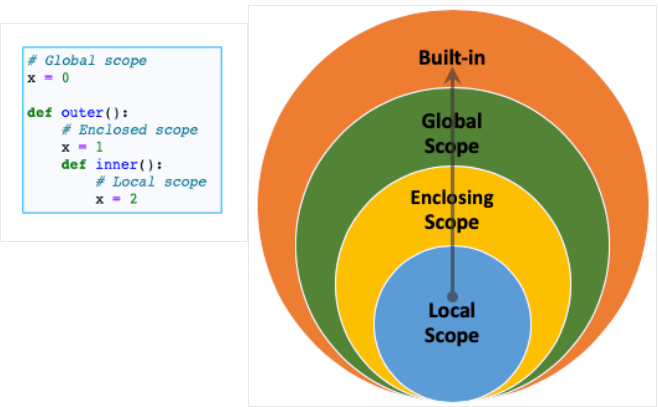
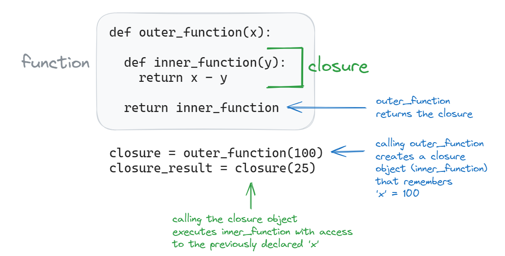
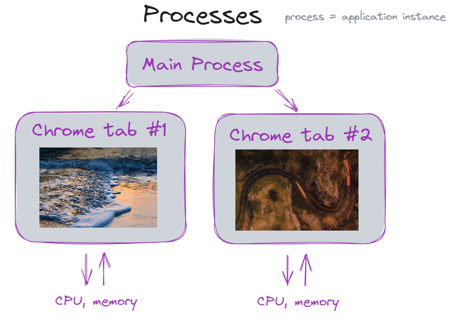
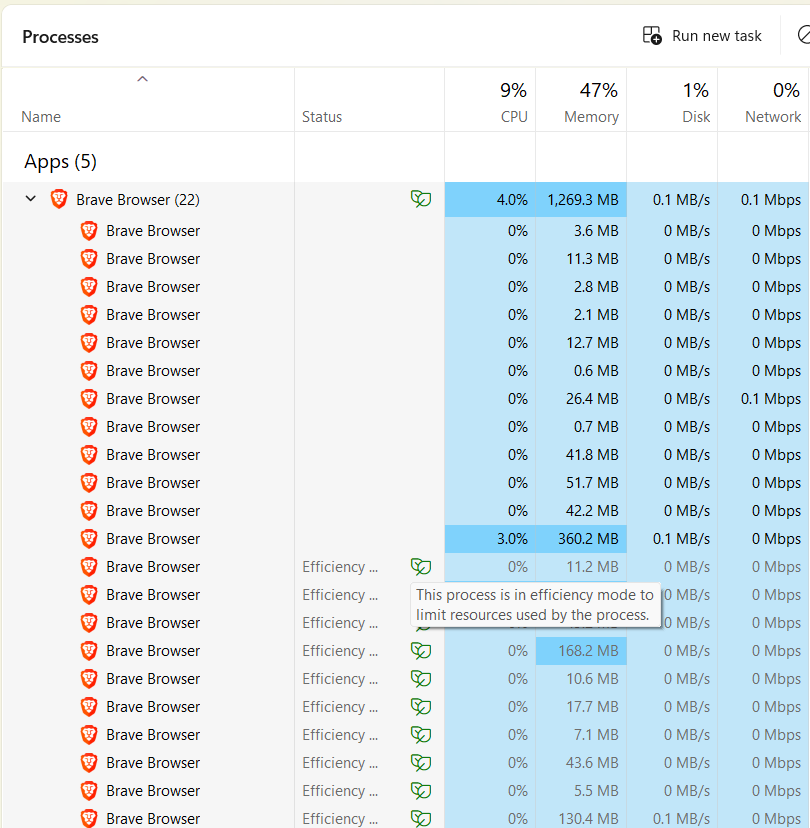
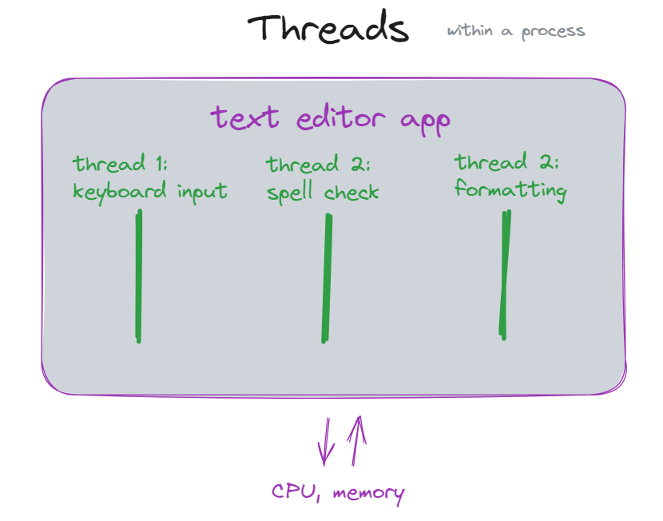
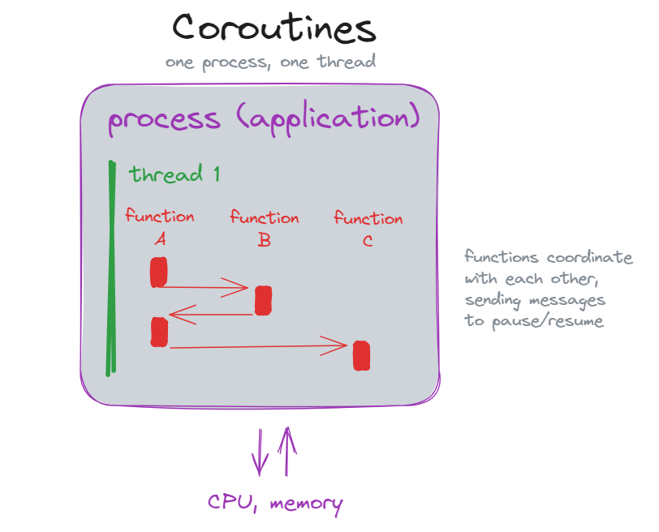

## Week 10 Agenda
- Checkins
   - team client request
   - questions or other issues
- Concurrency 
- P & M Chs 9-11


---
Lecture Topics:
- Timing
- Decorators
- Generators
- Concurrency
- Web scraping

---
## Burn down charts


---
## Coding topics we've covered so far
- install and configure coding tools: text editor/IDE
- terminal navigation
- setup project structure/directories
- configure coding environment: virtual environments, version control
- coding: data types, control flow statements, design patterns 
- testing

---
### What's left?
**For today:**
- Python timing, profiling
- P & M: bug fixes

**For future weeks:**
- Builds, packaging
- Continuous integration
- Continuous delivery and DevOps
- Refactoring

---
## Timing and profiling
We can now write code and write tests to verify it is working as intended

With code that executes, we can now look at other characteristics of the code:
- execution time / bottlenecks
- structure 


---
## Time in Python
Before we get to timing code, need to understand some of the timing options available. 

Libraries that deal with time:

- time
- datetime
- timeit - time functions, can specify a number of times to execute the code

---
## Using _time_ and _datetime_ libraries
**Datetime:** 
use for getting a date and time, esp. when formatting is important

**Time:** 
use for timing calculations, measuring differences in time
- **time()** function: time reported in seconds since January 1, 1970
- **perf_counter()** function: performance counter with greater resolution than time()

---
## Datetime example: display the time your code begins execution
```
import datetime
dt = datetime.datetime.today()
print(dt)
```

```
from datetime import datetime
dt = datetime.today()
print(dt)
```

_.today()_ returns datetime object, passing it to the print() function will format it YYYY-MM-DD H:M:S

---
## Datetime - string formatting
**strftime()**
- formats a datetime object
- allows custom specification of datetime elements
- returns a string

example (assuming 'import datetime'):
`datetime.datetime.today().strftime("%m-%d-%Y, %H:%M")`

**m** is month, **M** is minute; **y** is 2-digit year, **Y** is 4-digit year \
**d** is day, **D** is the date with 2-digit elements, i.e. '03/07/24'

---
#### -- help interlude --
- **dir(OBJECT)**
   - return all methods for the object
   - ex: `dir(datetime.datetime)` (with 'import datetime')
- **help(OBJECT)**
   - return the documentation for the object
   - ex: `help(datetime.datetime.today)` (with 'import datetime')
- **type(OBJECT)** // _isinstance(OBJECT, TYPE)_
   - return the type of the object // _bool that tests type_

---
## time() example
#### time how long your code takes to run

```
import time

start_time = time.time()
for x in range(1000):
  x ** 3
end_time = time.time()
lapsed = end_time - start_time
print(f'code ran in {lapsed} seconds')
```

---
## Profiling Tools
timeit library - runs small bits of code a specified number of times and reports average times

```
import timeit

def myfunc():
  for x in range(1000):
    x ** 3

print(timeit.timeit(myfunc, number=500))
```

---
#### Profiling Tools
cProfile - builtin profiling tool that will show you the speed of various function calls (each function gets a row)

[10-min video on how to use](https://www.youtube.com/watch?v=qXLh5sZLpHE)





---
## Revisiting our time() example
Timing one code snippet works OK, but a few of these and your code starts to look like...
```
# time myfunc1
start_time = time.perf_counter()
myfunc1()
end_time = time.perf_counter()
lapsed1 = end_time - start_time

# time myfunc2
start_time = time.perf_counter()
myfunc2()
end_time = time.perf_counter()
lapsed2 = end_time - start_time
```

---
#### stay DRY my friends
We don't want to have to keep copying the time code throughout our codebase.

Any ideas? Could always use builtin or existing libraries, but there may not be one available that fits our specific use case or we may want something with a lower overhead

**Other options**: 
1. create a function that prints the time, then call the time function within our function
2. write a custom decorator

---
# Let's write a custom decorator!

We've worked with decorators before:
- Flask routes
- Pytest markers

What is a decorator?
A decorator in python is an example of a closure.
ok, so what is a closure?

---
#### Before getting to closures, recall the Python scoping rules


---
### Key scoping takeaways
- more local overwrites more global
- when a function finishes execution, its named variables are no longer accessible
- if you name one of your scripts _concurrent.py_ and try to import the _concurrent_ library you will get an error message that makes you question your sanity

---
## Closures
**from wikipedia:** 
_"A closure is a technique for implementing lexically scoped name binding in a language with first-class functions"_

**let's try another way:**
A closure is a function object that has access to variables from its enclosing scope, even when called outside that scope

**what this means:**
The function remembers values in the enclosing scope even when they are not present in memory

---


---
An example in code:
[closure_simple.py](scripts/closure_simple.py)

Code available in the scripts/ dir in the [course github](https://github.com/damapak/ist303_spr2024)

Take a few minutes, look it over, try running it a few times with different values to grasp what is happening

---
## Back to writing a decorator
- we've now covered closures and the idea of accessing objects that would normally be outside of scope 
- seen an outer function that returns an inner function as a function object that can itself be called 
- this is exactly what a decorator does in python, but python takes care of the behind the scenes nuts and bolts

Let's see a coded example of a decorator function that can modify any function to print out the time the function began execution

---
## Sample Decorator
```
import datetime

def timestamp(func):   # decorator function

    def wrapper():
        print(f'Run time: {datetime.today().strftime("%Y-%m-%d %H:%M:%S")}')
        func()

    return wrapper

@timestamp
def func_to_run_inside_timestamp():
  ...

func_to_run_inside_timestamp()   # run this function passed to timestamp as arg  
```

---
## A More Useful Example
Now we can:
- use timing libraries
- understand custom decorators
- combine them to have a custom time decorator that can time any function

Now we just need a practical thing to time:
- Let's test the speed of accessing list vs. generator objects

---
## Generators
OK so we need to cover one more thing before writing our decorator:
what is a generator and how does it differ from a list?

In the same way list comprehensions are created by expressions such as [x for x in range(10) ], a generator object is created by using parentheses **()** instead of square brackets **[]**.

**List comprehension**: [x for x in range(10) ]
**Generator**: (x for x in range(10) )

---
## More on Generators
- are their own class of type 'generator'
- do not have methods or attributes
- contents are not viewable (i.e. with print, or by typing the var name)
- contents not stored in memory (generated on the fly as iterated through)
- items are consumed as the generator object is iterated over
- can step through them with `next(gen_obj)`

---
## Closures, Decorators, Generators _oh, my_
- **closure**: function that has access to variables from its enclosing scope, even when called outside that scope

- **decorators** are an example of a closure, they are a python implementation of a function that extends or modifies another function by passing it in as a parameter to the _decorator function_

- **generators** are a python object type that store an iterable where items are generated on the fly and not stored in the object (think a temporary list that vanishes as it is iterated over)


---
## Back to the task at hand
Now that we understand what a generator is, let's walk through a custom Decorator demo

Let's test the speed of accessing list vs. generator objects

[timing.py](/scripts/timing.py)

---
## Recap thus far
- **closures**: learned about closures: functions that access state outside their scope by being nested inside another function
- **decorators**: learned how to write a custom decorator in Python, a function that extends or enhances another function by passing it as an argeument to an enclosing function
- **timing in Python**: libraries to work with time, illustrated how to measure lapsed time of code execution
- **generators**: learned how they differ from lists, advantages and disadvantages
- **Python LEGB scoping**: how Python manages named objects and name conflicts

---


---
## Concurrency

All the code in the course thus far has been ***synchronous***: 
- every portion of code operates sequentially
- waits for current task to complete before proceeding 

**Concurrency** is where multiple tasks are interleaved as opposed to waiting on each other to complete.

Note that this is different from parallel execution, where execution takes place simultaneously.

---
## Processes, Threads, Coroutines
Concurrency can be achieved at different levels:

- Process - parallel execution at the application-level
- Thread - parallel execution within a single process
- Coroutine - orchestration of code execution within a single thread

---
## Processes
A process is a separate instance of an application. Processes:
- have their own space in memory
- can run simultaneously
- are non-locking - do not interfere with each other as they use separate memory, but do not have access to data from other processes 
- managed by the Operating System
- require more resources to start up and manage
- for more CPU-bound tasks (heavy calculations)

---



---


---
## Threads
Threads execute within a single process (application instance). Threads:
- share memory space with each other
- are locking - can be concurrent, but only one at a time can be making changes in memory at a time within a given process
- threads from different processes can run at the same time
- managed by application (in this case Python)
- less overhead/resources than a process
- for more I/O bound tasks (disk/network tasks)

---


---
## Coroutines
- smaller than processes and threads
- asynchronous: independent tasks on the same thread & process (single-threaded)
- utilize specially coded functions that communicate when they can pause/resume (need to use compatible libraries to gain benefits)
- achieve concurrency by passing control back and forth
- used in the asyncio library

---


---
## Python example
concurrent.futures library
- designed to simplify use of multiple threads and processes
- pg 289 in the Lubanovic text

[concurrent_simple.py](scripts/concurrent_simple.py)

_execute from test_dir w/venv activated - need requests lib_


---
## Asyncio
builtin Python library for handling asynchronous code
uses coroutines (functions/modules must be written to be able to pass/inherit control)

Notice that all the async examples in the textbook are asyncio.sleep or asyncio.create_task...

To do anything of consequence you need to know how to implement and use an async library

[async library list](https://github.com/timofurrer/awesome-asyncio/)

---
## Web scraping, synchronously
descriptions from [pypi](https://pypi.org/)

requests library - "Python HTTP for Humans"
- the "standard"
- synchronous


---
## Async web scraping
asynchronous options 
- httpx: "HTTPX is a fully featured HTTP client library for Python 3. It includes an integrated command line client, has support for both HTTP/1.1 and HTTP/2, and provides both sync and async APIs."
- aiohttp: "Async http client/server framework (asyncio)"
- asks: "asks is an async http lib for curio, trio and asyncio"

Page 525 has useful information on when to opt for multiple processes, threads, or async

---
# P & M Chapter 9 & 10
## Ch 9: Ending an Iteration
## Ch 10: The Next Iteration


---
## Towards the end of an iteration
Once your processes are in place, code has been tested and functions, and meets the user requirements, always other things you could do:
- process improvements (reflection)
- system testing
- refactoring (you'll always find things that could be improved)
- more design patterns?
- development environment updates (tools & dependencies)
- research new technological advances
- personal development time


---
### Sample iteration review questions
- is the team happy with the quality of work, documentation, and testing?
- how was the pace of the iteration? toot fast/slow?
- everyone comfortable with the area they are working in?
- Any tools helping/hurting? New tools that should be considered?
- Was the process effective? Any changes to consider?
- Code that needs to be revisited/refactored?
- any bugs that need to be discussed before prioritizing next iteration?
- is test coverage sufficient to give confidence in the system?

---
# P & M Chapter 11: Bugs

---
## Lifecycle of a bug
- tester finds a bug
- tester files a bug report - ALL bugs must be documented with necessary details
- create a story/task - prioritize with customer along with other remaining stories
- fix the bug
- check the fix to verify it works
- close the bug report (do not delete it)

---
## What should be in a bug report
- oveall summary
- steps needed to reproduce the bug
- what should have happened and what did happen
- version, platform, system information
- severity and priority

---
## Chapter 11: Squashing Bugs
What do you do when you inherit a codebase that is a mess?

Before making any code changes:
- Get code under version control
- Get code building (installed libraries, configure initialization, setup)
   - builds/installs without errors or warnings
- Do not (yet) worry about functionality

---
## Fix Functionality, not Code
You will see a lot that COULD be changed/improved
Resist the temptation to jump in and start fixing code!

1. Prioritize: what to fix?
   - write/fix code to fix **user stories**
   - focus on customer-oriented functionality
   - only fix what is broken
   - functional code > beautiful code

---
## Test the needed functionality
2. Determine what is broken
   - Tests
   - no test for a piece of functionality == it's broken
   - create a unit test that tests all the functionality you've identified that is needed 

---
## Next steps
- You know what functionality is needed (where to focus)
- You know what parts of code related to that functionality aren't working (tests)

In SD, once you know WHAT to do, what do you do next?

---
## Estimate how long it will take
Estimate using **spike testing**: 
- specify a set amount of time
- take a random sample of bugs
- see how many your team can fix in that amount of time
- at the end, calculate bugs/day and apply that to the # of remaining bugs

---
### When fixing bugs, what else should you fix? How far do you go?
The temptation will be to fix anything you come across.

Priorities should be:
1. get the code working
2. make the new code/fixes as readable as possible to prevent future bugs
3. move on to the next task once the bug is fixed
4. if needed, document other (potential) issues you discover and add them as bugs/tasks for a future iteration

---
## Coming Up

- Pair Exercise #4: Concurrency
   - due next week 4/3
- 4/3 Lecture, exercise assigned next week
- 4/10 Lecture + In-class work
- 4/17 Milestone 2.0 presentations

